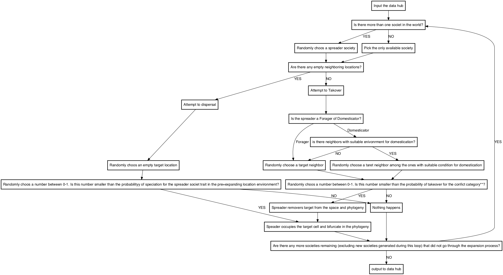

# Rule sets

```{r, echo=FALSE}
install.packages("DiagrammeR", repos = c(CRAN = "https://cran.revolutionanalytics.com"))
install.packages("DiagrammeRsvg", repos = c(CRAN = "https://cran.revolutionanalytics.com"))
install.packages("png", repos = c(CRAN = "https://cran.revolutionanalytics.com"))

library(DiagrammeR)
library(DiagrammeRsvg)
library(magrittr)
library(svglite)
library(rsvg)
library(png)

```


##Simulation:
  Building a model that simulates the spread of agriculture across human cultures took several independently built and validated components. The simulations play out in an arena defined by a spatial network of cultural centroids and those networks needed to be defined. Assigning agricultural suitability measures to each society required first modeling agricultural suitability across all environments and then assigning suitability values to each node in the spatial network. Events unfold as simulations progress through time and those events must be tracked from beginning to end. Running these simulations required the development of a stand-alone system for generating input parameters that control the experimental design.  Rules for how simulations operate were carefully designed to describe the behavior of each hypothesized mechanism. Each replicate simulation produced a spatial pattern and phylogenetic tree that are too complex to compare to each other directly so, each simulation output is summarized by 12 summary statistics that can be passed to the random forest machine learning algorithm for categorization. These six components each play an important role in the design and operation such a large-scale simulation. We describe each component of the simulation in more detail below. 

  There are 5 general behavioral continuation rules that correspond to the 5 categories of input variables described above. The first 3 rules are included in all models. Rules 4 and 5 are either included or excluded from the model to define different model types corresponding to different hypothesized mechanisms. These rules describe the possible ways that each node can change status (e.g. change from or to extant, extinct, forager, or domesticator) over the course of one time step and we define them as follows:

####1.	Arisal - 
A society switches their subsistence mode without any influence from ancestors or neighbors.  

####2.	Extinction - 
A society dies out. This terminates their branch of the phylogeny and resets their node to unoccupied. The probability of extinction is higher when the society's subsistence mode doesn't match their environment.  

####3.	Speciation - 
A society expands spatially across the network by sending a descendent diaspora to colonize an unoccupied adjoining node. This expansion into unoccupied territory creates a speciation event, where a new branch is added to the phylogeny showing a new society as a descendent of th e original society. If all adjoining nodes are occupied, then speciation cannot occur. The decedent society inherits their subsistence mode from the parent society, regardless of environment.

####4.	Diffusion - 
A society converts an occupied adjoining society to match its own subsistence mode. If there are no occupied neighboring nodes with an opposing subsistence mode, then diffusion cannot occur. 

####5.	Takeover - 
A society expands spatially across the network by sending a descendent diaspora to colonize an occupied adjoining node. If the target society is connected to an unoccupied node, then that society can flee this expansion and avoid extinction by abandoning their current node and colonizing that unoccupied node. If the target society is surrounded by occupied nodes, then they will go extinct when the expanding society colonizes their node. This extinction terminates their branch of the phylogeny and resets their spatial node to unoccupied. As with speciation, the expansion of the conquering society's diaspora creates a speciation event, where a new branch is added to the phylogeny showing a new society as a descendent of the original society. If all adjoining nodes are unoccupied, then takeover cannot occur. The decedent society of the conquer inherits their subsistence mode from the parent society, regardless of environment.

  To avoid any implied hierarchy between these rules or between nodes, both were randomized regularly. Within a single time step, the order of the rules were randomized before applying them to any nodes and then they were applied one-rule-at-a-time randomly (sampled without replacement) across all the nodes. One time step was complete when all the rules had been applied to all of the individual nodes. When one time step turns over to another, the order of rules is redrawn and they are again applied randomly across the nodes. This process was repeated for 30,000 time steps, which preliminary experiments showed was long enough for the system to reach equilibrium. Using preliminary trials of the simulations, we concluded that the model had reached equilibrium by plotting summary statistics through time and showing that statistics that asymptote usually do so between 10 and 20 thousand time steps so they are stabilized well before 30,000 time steps. 


```{r, echo=FALSE}
stnds.qa.d2 <-grViz("
  digraph {
    
    graph [overlap = TRUE, fontsize = 250]

    node [shape = box
          fontname = Helvetica]
    'Input the data hub'; 
    'Is there more than one societ in the world?'; 
    'Pick the only available society';
    'Randomly choos a spreader society';
    'Are there any empty neighboring locations?';
    'Attempt to Takover';
    'Is the spreader a Forager of Domesticator?';
    'is there neighbors with suitable enivonrment for domestication?';
    'Randomly choose a target neighbor';
    'Randomly choose a taret neighbor among the ones with suitable condition for domestication';
    'Randomly choos a number between 0-1. Is this number smaller than the probability of takeover for the confict category**?';
    'Spreader removers target from the space and phylogeny';
    'Nothing happens';
    'Speader occupies the target cell and bifurcate in the phylogeny';
    'Are there any more societies remaining (excluding new societies generated during this loop) that did not go through the expansion process?';
    'Attempt to dispersal';
    'Randomly choos an empty target location';
    'Randomly choos a number between 0-1. Is this number smaller than the probabilityy of speciation for the spreader societ trait in the pre=expanding location environment?';
    'output to data hub';

    edge []
    'Input the data hub' -> 'Is there more than one societ in the world?';
    'Is there more than one societ in the world?' -> 'Pick the only available society' [label = 'NO'];
    'Is there more than one societ in the world?' -> 'Randomly choos a spreader society' [label = 'YES'];
    'Pick the only available society' -> 'Are there any empty neighboring locations?';
    'Randomly choos a spreader society' -> 'Are there any empty neighboring locations?';
    'Are there any empty neighboring locations?' -> 'Attempt to dispersal' [label = 'YES'];
    'Are there any empty neighboring locations?' -> 'Attempt to Takover' [label = 'NO'];
    'Attempt to Takover' -> 'Is the spreader a Forager of Domesticator?';
    'Is the spreader a Forager of Domesticator?' -> 'is there neighbors with suitable enivonrment for domestication?' [label = 'Domesticator'];
    'Is the spreader a Forager of Domesticator?' -> 'Randomly choose a target neighbor' [label = 'Forager'];
    'is there neighbors with suitable enivonrment for domestication?' -> 'Randomly choose a target neighbor' [label = 'NO'];
    'is there neighbors with suitable enivonrment for domestication?' -> 'Randomly choose a taret neighbor among the ones with suitable condition for domestication' [label = 'YES'];
    'Randomly choose a taret neighbor among the ones with suitable condition for domestication' -> 'Randomly choos a number between 0-1. Is this number smaller than the probability of takeover for the confict category**?';
    'Randomly choose a target neighbor'  -> 'Randomly choos a number between 0-1. Is this number smaller than the probability of takeover for the confict category**?' ;
    'Randomly choos a number between 0-1. Is this number smaller than the probability of takeover for the confict category**?' -> 'Spreader removers target from the space and phylogeny' [label = 'YES'];
    'Randomly choos a number between 0-1. Is this number smaller than the probability of takeover for the confict category**?' -> 'Nothing happens' [label = 'NO'];
    'Nothing happens' -> 'Are there any more societies remaining (excluding new societies generated during this loop) that did not go through the expansion process?';
    'Are there any more societies remaining (excluding new societies generated during this loop) that did not go through the expansion process?' ->  'output to data hub' [label = 'NO'];
    'Attempt to dispersal' -> 'Randomly choos an empty target location';
    'Randomly choos an empty target location' -> 'Randomly choos a number between 0-1. Is this number smaller than the probabilityy of speciation for the spreader societ trait in the pre=expanding location environment?';
    'Randomly choos a number between 0-1. Is this number smaller than the probabilityy of speciation for the spreader societ trait in the pre=expanding location environment?' -> 'Speader occupies the target cell and bifurcate in the phylogeny' [label = 'YES'];
    'Randomly choos a number between 0-1. Is this number smaller than the probabilityy of speciation for the spreader societ trait in the pre=expanding location environment?' -> 'Nothing happens' [label = 'NO'];
  'Are there any more societies remaining (excluding new societies generated during this loop) that did not go through the expansion process?' ->  'Is there more than one societ in the world?' [label = 'YES'];
  'Speader occupies the target cell and bifurcate in the phylogeny' -> 'Are there any more societies remaining (excluding new societies generated during this loop) that did not go through the expansion process?';
  'Spreader removers target from the space and phylogeny' -> 'Speader occupies the target cell and bifurcate in the phylogeny';
  }") 
  
   
tmp<-capture.output(rsvg_png(charToRaw(export_svg(stnds.qa.d2)),'stnds.qa.png', width=5800, height=4800))


```





```


