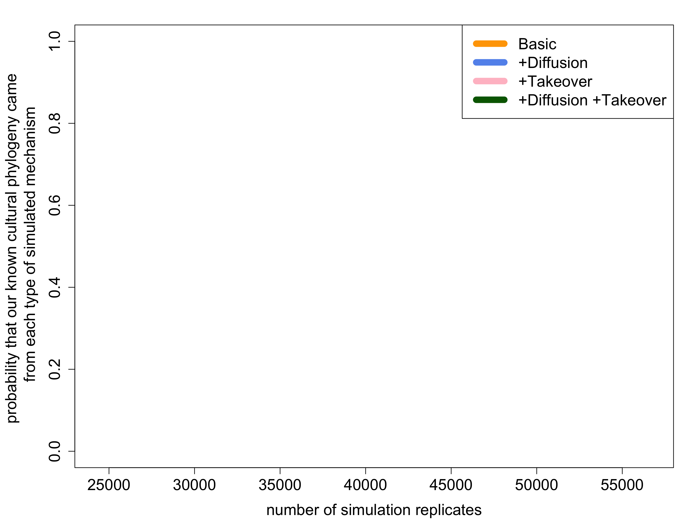
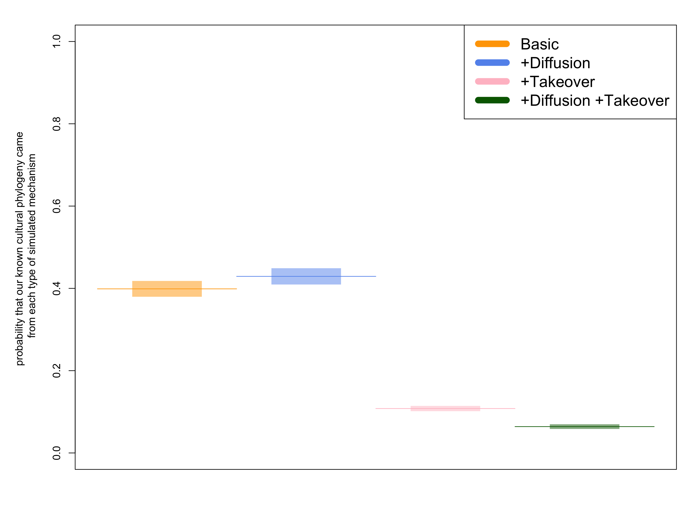
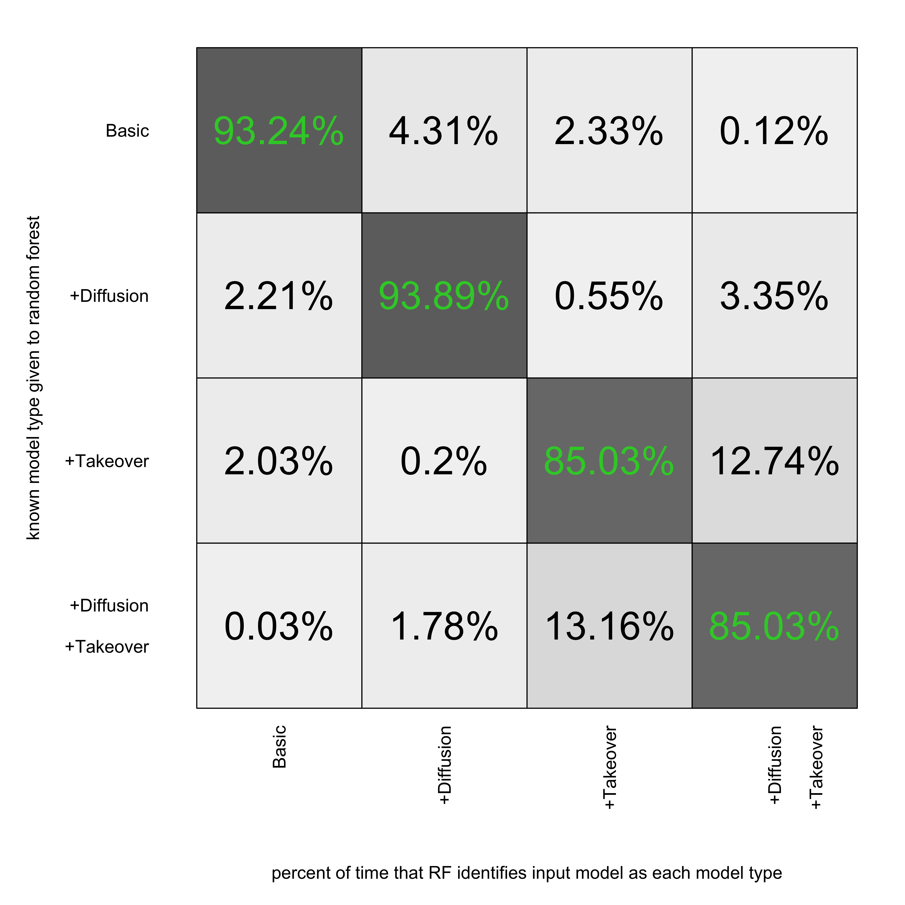

# Module 3: Analysing results produce from Modules 1 and 2

```{r}
library(png)
```


## Organize data
```{r, eval=FALSE}
# A frequent scenario in our analysis code is that we need to read thousands of 
# output files into a single table. 
# There are a couple flavors of file name that need to be dealt with and the 
# output file needs to include a column with the full file name for reference 
# later. We want to save the final table as it's own file to a folder outside of 
# the one we just read. 

## Here is one flaver where the input is two folders, one with extant 
# simulations and one with extinct simulations. Need to read the files and 
# produce two tables, one for extinct and one for extant. 

## First consolidate the available files into a single table
concatenate <- function(path) {
 available <- list.files(path, full.names = TRUE)
 name <- unlist(strsplit(available[1], split="_"))
 n <- length(available)
 n_name <- length(name) - 1
 load(available[1])
 ncol_files <- length(Sim_statistics[[1]]) + n_name
 files <- matrix(nrow = n,
                 ncol = ncol_files)
 split_names <- function(x){unlist(strsplit(x, split = "_"))}
 name_available <- do.call(rbind, lapply(as.list(available), split_names))
 files[, 1:n_name] <- name_available[, -ncol(name_available)]

 for (i in 1:n) {
   error <- try(load(available[i]), silent = TRUE)
   if (class(error) != "try-error") {
     files[i, (n_name + 1):ncol_files] <- Sim_statistics[[1]]
   }
 }


 files <- files[, -c(1, 2, 3, 5, 7, 8, 13, 18, 23, 28, 33, 35)]
 last_name <- colnames(Sim_statistics[[1]])
 if (is.null(last_name)) {

   files <- files[, -ncol(files)]
 }
 colnames(files) <-  c("Sim_stats_rep", "combo", paste0("P.speciation", 1:4),
                       paste0("P.extinct", 1:4),  paste0("P.diffus", 1:4),
                       paste0("P.TO", 1:4),  paste0("P.Arisal", 1:4), 
                       "timesteps", "NBS", last_name)

 Concatenated_data <- as.data.frame(files)

 begin <- which(colnames(Concatenated_data) ==  "number_of_branches")
 Concatenated_data_stat <- Concatenated_data[, begin:ncol(Concatenated_data)]
 Concatenated_data_stat <- apply(Concatenated_data_stat, 2, as.numeric)
 remove <- which(is.na(rowSums(Concatenated_data_stat)))
 Concatenated_data <- Concatenated_data[-remove, ]

 one <- subset(Concatenated_data, combo =="01")
 two <- subset(Concatenated_data, combo =="02")
 five <- subset(Concatenated_data, combo =="05")
 six <- subset(Concatenated_data, combo =="06")

 crop <- min(sapply(list(one, two, five, six), nrow))

 one <- one[1:crop, ]
 two <- two[1:crop, ]
 five <- five[1:crop, ]
 six <- six[1:crop, ]

 Concatenated_data2 <- rbind(one, two, five, six)
 res <- list(Concatenated_data, Concatenated_data2, crop)
 names(res) <- c("Concatenated_data", "Concatenated_data_crop", "crop")
 return(res)
 
}

path <- "~/Box Sync/Four model compare third run/Module 2"
Concatenated_data0 <- concatenate(path)
print(Concatenated_data0[[3]])
path_save <- "~/Box Sync/Four model compare third run"
Concatenated_data <- Concatenated_data0[[1]]
save(Concatenated_data, file = paste0(path_save,
                                     "/Four_model_compare_results_not_cropped.Rdata"))
Concatenated_data <- Concatenated_data0[[2]]
save(Concatenated_data, file=paste0(path_save,
                                   "/Four_model_compare_results_", 
                                   format(Sys.time(), format="%d_%b_%Y"),
                                   "_crop_to_", Concatenated_data0[[3]],".Rdata"))

### Repeated for extinct
path <- "~/Box Sync/Four model compare third run/Module 2 extinct"
Concatenated_data <- concatenate(path)[[1]]
path_save <- "~/Box Sync/Four model compare third run"

save(Concatenated_data, file=paste0(path_save,
                                   "/Four_model_compare_results_extinct_", 
                                   format(Sys.time(), format="%d_%b_%Y"),".Rdata"))


```


## Diagnostics

```{r}
#objects()
#head(Concatenated_data)
#names(Concatenated_data)
BL <- scale(log(as.numeric(as.character(Concatenated_data$Pylo_diversity_is_sum_of_BL))), scale=FALSE, center=TRUE)
#25:54, ! 39, 

load('~/Dropbox/Nature_FARM_publication_prep/Code for publication/RF after bruno/Four_model_compare_results_23_Oct_2017_crop_to_10323.Rdata')

for(i in 25:54){
s <- as.numeric(as.character(Concatenated_data[,i]))
#range01 <- function(x){(x-min(x))/(max(x)-min(x))}

Concatenated_data[,i] <- scale(s)


}

#head(Concatenated_data)
#Concatenated_data$combo
M1 <- subset(Concatenated_data, combo == "01")
M2 <- subset(Concatenated_data, combo == "02")
M3 <- subset(Concatenated_data, combo == "05")
M4 <- subset(Concatenated_data, combo == "06")

png("scaled stats per model.png", height=247, width=89, units = "mm", res = 1000)
par(mfrow=c(4,1), mar=c(2,5,2,2))
barplot(colMeans(M1[,26:54], na.rm = FALSE, dims = 1), col=rainbow(32), xlim=c(-1,1), las=2, main="Basic", horiz=TRUE, names.arg=seq(1,29), col.lab = 0.5)
grid()
barplot(colMeans(M2[,26:54], na.rm = FALSE, dims = 1), col=rainbow(32), xlim=c(-1,1), las=2, main="+Diffusion", horiz=TRUE, names.arg=seq(1,29))
grid()
barplot(colMeans(M3[,26:54], na.rm = FALSE, dims = 1), col=rainbow(32), xlim=c(-1,1), las=2, main="+Takeover", horiz=TRUE, names.arg=seq(1,29))
grid()
barplot(colMeans(M4[,26:54], na.rm = FALSE, dims = 1), col=rainbow(32), xlim=c(-1,1), las=2, main="+Diffusion \n +Takeover", horiz=TRUE, names.arg=seq(1,29))
grid()
dev.off()


```


```{r eval=FALSE}
load("Four_model_compare_results_02_Aug_2017_crop_to_6128.Rdata")
extant <- Concatenated_data
extant

 load("Four_model_compare_results_extinct_02_Aug_2017.Rdata")
extinct <- Concatenated_data
extinct

head(extant)
head(extinct)
```


```{r eval=FALSE}

for(i in c(3:22)){
	extinct[which(is.nan(as.numeric(as.character(extinct[, i]))) == TRUE), i] <- NA
}

for(i in c(3:22)){
	extant[which(is.nan(as.numeric(as.character(extant[, i]))) == TRUE), i] <- NA
}


xlimit <- c(0,1)
ylimit <- c(0,3000)
maincex <- 0.9

png(file="Global_success_rate_per_parameter.png", width=8.5, height=11, units="in", res=300)

par(mfrow=c(5,4), mar=c(3,3,3,0))


hist(as.numeric(as.character(extinct[,3])), main="speciation of F in F env", col=adjustcolor("firebrick", alpha=0.7), breaks=100, border=NA, xlim= xlimit, ylim= ylimit, cex.main= maincex)
hist(as.numeric(as.character(extant[,3])), main="speciation of F in F env", col=adjustcolor("cornflowerblue", alpha=0.7), breaks=100, border=NA, xlim= xlimit, ylim= ylimit, cex.main= maincex, add=TRUE)


hist(as.numeric(as.character(extinct[,4])), main="speciation of D in F env", col=adjustcolor("firebrick", alpha= 0.7), breaks=100, border=NA, xlim= xlimit, ylim= ylimit, cex.main= maincex)
hist(as.numeric(as.character(extant[,4])), main="speciation of D in F env", col=adjustcolor("cornflowerblue", alpha= 0.7), breaks=100, border=NA, xlim= xlimit, ylim= ylimit, cex.main= maincex, add=TRUE)


hist(as.numeric(as.character(extinct[,5])), main="speciation of F in D env", col=adjustcolor("firebrick", alpha= 0.7), breaks=100, border=NA, xlim= xlimit, ylim= ylimit, cex.main= maincex)
hist(as.numeric(as.character(extant[,5])), main="speciation of F in D env", col=adjustcolor("cornflowerblue", alpha= 0.7), breaks=100, border=NA, xlim= xlimit, ylim= ylimit, cex.main= maincex, add=TRUE)

hist(as.numeric(as.character(extinct[,6])), main="speciation of D in D env", col=adjustcolor("firebrick", alpha= 0.7), breaks=100, border=NA, xlim= xlimit, ylim= ylimit, cex.main= maincex)
hist(as.numeric(as.character(extant[,6])), main="speciation of D in D env", col=adjustcolor("cornflowerblue", alpha= 0.7), breaks=100, border=NA, xlim= xlimit, ylim= ylimit, cex.main= maincex, add=TRUE)

#######

hist(as.numeric(as.character(extinct[, 7])), main="extinction of F in F env", col=adjustcolor("firebrick", alpha= 0.7), breaks=100, border=NA, xlim= xlimit, ylim= ylimit, cex.main= maincex)
hist(as.numeric(as.character(extant[, 7])), main="extinction of F in F env", col=adjustcolor("cornflowerblue", alpha= 0.7), breaks=100, border=NA, xlim= xlimit, ylim= ylimit, cex.main= maincex, add=TRUE)


hist(as.numeric(as.character(extinct[, 8])), main="extinction of D in F env", col=adjustcolor("firebrick", alpha= 0.7), breaks=100, border=NA, xlim= xlimit, ylim= ylimit, cex.main= maincex)
hist(as.numeric(as.character(extant[, 8])), main="extinction of D in F env", col=adjustcolor("cornflowerblue", alpha= 0.7), breaks=100, border=NA, xlim= xlimit, ylim= ylimit, cex.main= maincex, add=TRUE)

hist(as.numeric(as.character(extinct[, 9])), main="extinction of F in D env", col=adjustcolor("firebrick", alpha= 0.7), breaks=100, border=NA, xlim= xlimit, ylim= ylimit, cex.main= maincex)
hist(as.numeric(as.character(extant[, 9])), main="extinction of F in D env", col=adjustcolor("cornflowerblue", alpha= 0.7), breaks=100, border=NA, xlim= xlimit, ylim= ylimit, cex.main= maincex, add=TRUE)

hist(as.numeric(as.character(extinct[, 10])), main="extinction of D in D env", col=adjustcolor("firebrick", alpha= 0.7), breaks=100, border=NA, xlim= xlimit, ylim= ylimit, cex.main= maincex)
hist(as.numeric(as.character(extant[, 10])), main="extinction of D in D env", col=adjustcolor("cornflowerblue", alpha= 0.7), breaks=100, border=NA, xlim= xlimit, ylim= ylimit, cex.main= maincex, add=TRUE)

######

hist(as.numeric(as.character(extinct[, 11])), main="arisal of F in F env", col=adjustcolor("firebrick", alpha= 0.7), breaks=100, border=NA, xlim= xlimit, ylim= ylimit, cex.main= maincex)
hist(as.numeric(as.character(extant[, 11])), main="arisal of F in F env", col=adjustcolor("cornflowerblue", alpha= 0.7), breaks=100, border=NA, xlim= xlimit, ylim= ylimit, cex.main= maincex, add=TRUE)


hist(as.numeric(as.character(extinct[, 12])), main="arisal of D in F env", col=adjustcolor("firebrick", alpha= 0.7), breaks=100, border=NA, xlim= xlimit, ylim= ylimit, cex.main= maincex)
hist(as.numeric(as.character(extant[, 12])), main="arisal of D in F env", col=adjustcolor("cornflowerblue", alpha= 0.7), breaks=100, border=NA, xlim= xlimit, ylim= ylimit, cex.main= maincex, add=TRUE)

hist(as.numeric(as.character(extinct[, 13])), main="arisal of F in D env", col=adjustcolor("firebrick", alpha= 0.7), breaks=100, border=NA, xlim= xlimit, ylim= ylimit, cex.main= maincex)
hist(as.numeric(as.character(extant[, 13])), main="arisal of F in D env", col=adjustcolor("cornflowerblue", alpha= 0.7), breaks=100, border=NA, xlim= xlimit, ylim= ylimit, cex.main= maincex, add=TRUE)

hist(as.numeric(as.character(extinct[, 14])), main="arisal of D in D env", col=adjustcolor("firebrick", alpha= 0.7), breaks=100, border=NA, xlim= xlimit, ylim= ylimit, cex.main= maincex)
hist(as.numeric(as.character(extant[, 14])), main="arisal of D in D env", col=adjustcolor("cornflowerblue", alpha= 0.7), breaks=100, border=NA, xlim= xlimit, ylim= ylimit, cex.main= maincex, add=TRUE)

######

hist(as.numeric(as.character(extinct[, 15])), main="NOPE -- Diffusion: source F, target F", col=adjustcolor("firebrick", alpha= 0.7), breaks=100, border=NA, xlim= xlimit, ylim= c(0,18000), cex.main= maincex)
hist(as.numeric(as.character(extant[, 15])), main="NOPE -- Diffusion: source F, target F", col=adjustcolor("cornflowerblue", alpha= 0.7), breaks=100, border=NA, xlim= xlimit, ylim= c(0,18000), cex.main= maincex, add=TRUE)


hist(as.numeric(as.character(extinct[, 16])), main="Diffusion: source D, target F", col=adjustcolor("firebrick", alpha= 0.7), breaks=100, border=NA, xlim= xlimit, ylim= ylimit, cex.main= maincex)
hist(as.numeric(as.character(extant[, 16])), main="Diffusion: source D, target F", col=adjustcolor("cornflowerblue", alpha= 0.7), breaks=100, border=NA, xlim= xlimit, ylim= ylimit, cex.main= maincex, add=TRUE)

hist(as.numeric(as.character(extinct[, 17])), main="Diffusion: source F, target D", col=adjustcolor("firebrick", alpha= 0.7), breaks=100, border=NA, xlim= xlimit, ylim= ylimit, cex.main= maincex)
hist(as.numeric(as.character(extant[, 17])), main="Diffusion: source F, target D", col=adjustcolor("cornflowerblue", alpha= 0.7), breaks=100, border=NA, xlim= xlimit, ylim= ylimit, cex.main= maincex, add=TRUE)

hist(as.numeric(as.character(extinct[, 18])), main="NOPE -- Diffusion: source D, target D", col=adjustcolor("firebrick", alpha= 0.7), breaks=100, border=NA, xlim= xlimit, ylim= c(0,18000), cex.main= maincex)
hist(as.numeric(as.character(extant[, 18])), main="NOPE -- Diffusion: source D, target D", col=adjustcolor("cornflowerblue", alpha= 0.7), breaks=100, border=NA, xlim= xlimit, ylim= c(0,18000), cex.main= maincex, add=TRUE)

####

hist(as.numeric(as.character(extinct[, 19])), main="Takeover: source F, target F", col=adjustcolor("firebrick", alpha= 0.7), breaks=100, border=NA, xlim= xlimit, ylim= ylimit, cex.main= maincex)
hist(as.numeric(as.character(extant[, 19])), main="Takeover: source F, target F", col=adjustcolor("cornflowerblue", alpha= 0.7), breaks=100, border=NA, xlim= xlimit, ylim= ylimit, cex.main= maincex, add=TRUE)


hist(as.numeric(as.character(extinct[, 20])), main="Takeover: source D, target F", col=adjustcolor("firebrick", alpha= 0.7), breaks=100, border=NA, xlim= xlimit, ylim= ylimit, cex.main= maincex)
hist(as.numeric(as.character(extant[, 20])), main="Takeover: source D, target F", col=adjustcolor("cornflowerblue", alpha= 0.7), breaks=100, border=NA, xlim= xlimit, ylim= ylimit, cex.main= maincex, add=TRUE)

hist(as.numeric(as.character(extinct[, 21])), main="Takeover: source F, target D", col=adjustcolor("firebrick", alpha= 0.7), breaks=100, border=NA, xlim= xlimit, ylim= ylimit, cex.main= maincex)
hist(as.numeric(as.character(extant[, 21])), main="Takeover: source F, target D", col=adjustcolor("cornflowerblue", alpha= 0.7), breaks=100, border=NA, xlim= xlimit, ylim= ylimit, cex.main= maincex, add=TRUE)

hist(as.numeric(as.character(extinct[, 22])), main="Takeover: source D, target D", col=adjustcolor("firebrick", alpha= 0.7), breaks=100, border=NA, xlim= xlimit, ylim= ylimit, cex.main= maincex)
hist(as.numeric(as.character(extant[, 22])), main="Takeover: source D, target D", col=adjustcolor("cornflowerblue", alpha= 0.7), breaks=100, border=NA, xlim= xlimit, ylim= ylimit, cex.main= maincex, add=TRUE)


dev.off()


```


## Random Forest Analysis

### Training/Building
  The procedures described so far have outlined the creation of a dataset that includes the input and output variables for each replicate simulation. When taken as a whole, that dataset describes a distribution of possible numerical outcomes that are possible given the 4 available input types. The purpose of the random forest machine learning algorithm (Breiman 2001, Liaw and Wiener 2015) was to correlate input and output variables as a means of categorizing simulation outputs according to the type of input that had created them. We used 70% of our available simulation data to build the random forest, the remaining 30% to test the forest's accuracy and precision at inferring input categories, and then used that trained and vetted algorithm to infer the most likely input category for real world human output data.

  This random forest model was trained by building a forest of decision trees. Each decision tree describes a series of ordered dichotomous decisions that categorize the 12 output statistics into one of 4 input types. Individual trees were built by first taking a randomly sized and randomly selected sample of rows (replicate simulations) and columns (output variables) from the full simulation dataset to create a unique subset dataset. That unique dataset was then subjected to a bagging model to rank the variables in order of importance and build a decision tree off of that rank. We repeated this process, with replacement, to build 3000 individual decision trees sampled from 70% (n = 40000 x 0.7 = 28000) of the total simulation data. 

### Testing
  The random forest was vetted using the remaining 30% of the simulation data reserved for model testing. Rather than building decision trees with these data, we fed each replicate through the recently built forest so it could classify outputs and then compare those inferred input types to the known input types to the to see how frequently the forest returned the correct classification. The accuracy and precision of these tests are reported in a confusion matrix showing the number of matches that were correctly or incorrectly made between inputs and outputs for each model . 
Our trained random forest algorithm could correctly match output statistics with input mechanisms with very good accuracy . It is noteworthy that there was very little confusion between the two competing hypothesized mechanisms, diffusion and diffusion by takeover. If the trained random forest algorithm is presented with a simulation created by diffusion, if is very unlikely to be classify it as coming from diffusion by takeover. 

### Matching
  The structure of our simulation outputs where designed to mimic the structure of our real cultural data so that the two could be compared directly. In the same way the output for replicate simulations where processed, the phylogeny and spatial pattern of extant human cultures were summarized using 12 summary statistics passed to the trained random forest algorithm. The random forest assigned the most likely mechanism to have caused that human's known historical trajectory. It does this by asking every dichotomous decision tree in the random forest to vote on which hypothesized mechanism created the output provided by the data and then tallying those votes into a consensus vote. Our consensus vote showed that over 50% of the trees believe that the current configuration of agriculture across the globe is the result of demic diffusion augmented by cultural diffusion. About 35% of the trees assigned known global trend to the basic model that includes only demic diffusion, while the other two models received almost no votes. This suggest that if we are wrong that demic and cultural diffusion contributed to current distributions of agriculturist cultures, the next most likely answer is that it diffusion created these patterns with no help from cultural diffusion.


## Run a single random forest on available outputs
```{r, eval=FALSE}
# Packages
library(randomForest)

# Radom Forest Function
RF <- function(table_sim, table_real, ntree = 2000, stats_remove = NULL,
              repetitions = 1) {
 # table_sim = table croped 

 begin <- which(colnames(table_sim) ==  "number_of_branches")
 table_sim_data <- table_sim[, begin:ncol(table_sim)]
 table_sim_data <- apply(table_sim_data, 2, as.numeric)
 if (any(is.infinite(table_sim_data))) {
   stop("There is infinite values in the simulation statistics")
 }
 rf_data <- data.frame("Model" = table_sim$combo, table_sim_data)
 rf_data_real <- data.frame(table_real)

 if (!is.null(stats_remove)) {
   rf_data <- rf_data[, -stats_remove]
   rf_data_real <- rf_data_real[, -stats_remove]
 }

 fun <- function(x, y, per = .33) {
   sample(which(y$Model == x), round(table(y$Model)[1]*per))
 }

 results <- matrix(nrow = repetitions, ncol = length(table_real) * 6 + 21)
 for (i in 1:repetitions) {
   sub.test <- unlist(lapply(as.list(paste0(0, c(1,2,5,6))), fun,
                             y = rf_data))
   test2 <- rf_data[sub.test, 2:ncol(rf_data)]
   test1 <- rf_data[sub.test, 1]
   train <- rf_data[-sub.test, ]

   fit <- randomForest(Model ~ ., data = train, xtest = test2, 
                       ytest = test1, importance = TRUE, 
                       ntree = ntree, keep.forest = TRUE,
                       replace = TRUE)
  #dev.new()
  #plot(fit)
  
   predictions <- predict(fit, rf_data_real, type = "prob")
  
   var_import <- importance(fit)

   error <- mean(fit$test$confusion[, 5])
   confusion <- as.numeric(fit$test$confusion[, 1:4])
   names(confusion) <- paste0("Confusion_", 
                              rep(colnames(fit$test$confusion[, 1:4]),
                                  each = 4),
                              rownames(fit$test$confusion[, 1:4]))
   predictions_prob <- as.numeric(predictions)
   names(predictions_prob) <- paste0("Prediction_prob", colnames(predictions))
   var_import_vec <- as.numeric(var_import)
   names(var_import_vec) <- paste0("var_imp_", 
                                   rep(colnames(var_import), 
                                       each = nrow(var_import)),
                                   "_",
                                   rownames(var_import))
   vec <- c(error, confusion, predictions_prob, var_import_vec)
   
   results[i, ] <- vec
 }
 colnames(results) <- names(vec)
 colnames(results)[1] <- "Error_test"
 results <- cbind(1:nrow(results), results)
 colnames(results)[1] <- "Replicate"
 return(results)
}

# Multiple Random Forest
RF_mult <- function(table_sim, table_real_mult, ntree = 2000, 
                   stats_remove = NULL, repetitions = 1) {
 n_r <- nrow(table_real_mult)
 n <- repetitions * n_r
 n_col <- ncol(table_real_mult) * 6 + 22
 results <- matrix(nrow = n, ncol = n_col)
 x <- 0
 for (i in seq(1, n, repetitions)) {
   print(paste0("randomForest start for tree", i))
   x <- x + 1
   temp <- RF(table_sim, 
              table_real_mult[x, , drop = FALSE],
              ntree = ntree, 
              repetitions = repetitions, 
              stats_remove = stats_remove)
   results[i:(i + repetitions - 1), ] <- temp
 }
 tree <- rep(1:n_r, each = repetitions)
 results <- cbind(tree, results)
 colnames(results) <- c("Tree", colnames(temp))
 return(results)
}

# Accumulation function
RF_acum <- function(table_sim, table_real_mult, ntree = 2000, 
                   stats_remove = NULL, repetitions = 1,
                   resolution = 100, minimun = 100) {
 sequence <- seq(minimun, nrow(table_sim), resolution)[2]
 n_col <- ncol(table_real_mult) * 6 + 24 
 n_r <- nrow(table_real_mult)
 n_seq <- length(sequence)
 n <- repetitions * n_r * n_seq
 results <- matrix(nrow = n, ncol = n_col)
 lottery1 <- which(table_sim$combo == "01")
 lottery2 <- which(table_sim$combo == "02")
 lottery5 <- which(table_sim$combo == "05")
 lottery6 <- which(table_sim$combo == "06")
 sub1 <- sample(lottery1, sequence[1]/4, replace = FALSE)
 sub2 <- sample(lottery2, sequence[1]/4, replace = FALSE)
 sub5 <- sample(lottery5, sequence[1]/4, replace = FALSE)
 sub6 <- sample(lottery6, sequence[1]/4, replace = FALSE)
 for (i in 1:n_seq) {
   if (i != 1) {
     sub1 <- c(sub1, sample(lottery1[-sub1], sequence[1]/4, replace = FALSE))
     sub2 <- c(sub2, sample(lottery2[-sub2], sequence[1]/4, replace = FALSE))
     sub5 <- c(sub5, sample(lottery5[-sub5], sequence[1]/4, replace = FALSE))
     sub6 <- c(sub6, sample(lottery6[-sub6], sequence[1]/4, replace = FALSE))
   }
  print(paste0("MULTI --------------------------- RF -- ", i))
   temp <- RF_mult(table_sim[c(sub1, sub2, sub5, sub6), ], table_real_mult,
                   ntree = ntree, repetitions = repetitions,
                   stats_remove = stats_remove)
   n_temp <- nrow(temp)
   results[1:n_temp + (n_temp * (i - 1)), ] <- cbind(rep(sequence[i],
                                                         n_temp), temp)
 }
 colnames(results) <- c("Subsample_size", colnames(temp))
 return(results)
}

# TEST FINAL (RUN ONLY THIS)
# Load data
setwd("~/Dropbox/Nature_FARM_publication_prep/Code for publication/RF after bruno")
load('Four_model_compare_results_23_Oct_2017_crop_to_10323.Rdata')
load("real.analysis_mult.RData")

table_sim = Concatenated_data
table_real = real.analysis.mult[[1]][[1]]
table_real_mult = do.call(rbind, lapply(real.analysis.mult, 
                                       function(x){x[[1]]}))
dim(table_real_mult[,,drop=FALSE])
#start time
time_start <- Sys.time()

# Change the parameters as you wish
## table_real_mult is the distribution of possible trees provided by MPI
## table_sim is our simulated data
res_acum <- RF_acum(table_sim, table_real_mult[1:200,,drop=FALSE], ntree = 10000, 
                   stats_remove = NULL, repetitions = 1,
                   resolution = 5000, minimun = 9500)
                   
#stop time
time_stop <- Sys.time()
difftime(time_stop, time_start)                   

save(res_acum, file="Random_Forest_output_data_for_publication_5_February_2018.Rdata")


```


## Visualize outputs from Random Forest analysis

```{r eval=FALSE}
# load outputs from RF runs
load("/Users/Ty/Desktop/small_RF_out.Rdata")
a <- res_acum

load("/Users/Ty/Desktop/10_more_tree_out.Rdata")
b <- res_acum

load("/Users/Ty/Desktop/10_tree_out.Rdata")
c <- res_acum

#object called res_acum
res_acum <- rbind(b,c)

load("Random_Forest_output_data_for_publication_2_February_2018.Rdata")

```


```{r, eval=FALSE}
png("overall_error_per_sample_size.png", width = 11, height = 8.5, res = 300, units = "in")
plot(aggregate(x = res_acum[, 4], by = list((res_acum[, 1])), FUN = mean), type="l", ylim=c(0,0.5), ylab="overall confusion error", xlab="sample size")
dev.off()
```


```{r, eval=FALSE}


png("predictions.png", width = 11, height = 8.5, res = 300, units = "in")
par(mar=c(5,6,2,1))

# Change argument FUN to sd to obtain the standard deviation
plot(aggregate(x = res_acum[, 4], by = list((res_acum[, 1])), FUN = mean), type = "n", ylim=c(0,1), ylab="probability that our known cultural phylogeny came \n from each type of simulated mechanism", xlab="number of simulation replicates", cex.axis=1.5, cex.lab=1.5)


basic_mean <- aggregate(x = res_acum[, 21], by = list((res_acum[, 1])), FUN = mean)
diffusion_mean <- aggregate(x = res_acum[, 22], by = list((res_acum[, 1])), FUN = mean)
TO_mean <- aggregate(x = res_acum[, 23], by = list((res_acum[, 1])), FUN = mean)
both_mean <- aggregate(x = res_acum[, 24], by = list((res_acum[, 1])), FUN = mean)
                   
basic_sd <- aggregate(x = res_acum[, 21], by = list((res_acum[, 1])), FUN = sd)
diffusion_sd <- aggregate(x = res_acum[, 22], by = list((res_acum[, 1])), FUN = sd)
TO_sd <- aggregate(x = res_acum[, 23], by = list((res_acum[, 1])), FUN = sd)
both_sd <- aggregate(x = res_acum[, 24], by = list((res_acum[, 1])), FUN = sd)


polygon(x=c(basic_mean[,1], rev(basic_mean[,1])), y=c(basic_mean[,2] + basic_sd[,2], rev(basic_mean[,2] - basic_sd[,2])), col=adjustcolor("orange", alpha=0.5), border=NA)
polygon(x=c(diffusion_mean[,1], rev(diffusion_mean[,1])), y=c(diffusion_mean[,2] + diffusion_sd[,2], rev(diffusion_mean[,2] - diffusion_sd[,2])), col=adjustcolor("cornflowerblue", alpha=0.5), border=NA)
polygon(x=c(TO_mean[,1], rev(TO_mean[,1])), y=c(TO_mean[,2] + TO_sd[,2], rev(TO_mean[,2] - TO_sd[,2])), col=adjustcolor("pink", alpha=0.5), border=NA)
polygon(x=c(both_mean[,1], rev(both_mean[,1])), y=c(both_mean[,2] + both_sd[,2], rev(both_mean[,2] - both_sd[,2])), col=adjustcolor("darkgreen", alpha=0.5), border=NA)


lines(basic_mean,  col="orange")
lines(diffusion_mean,  col="cornflowerblue")
lines(TO_mean,  col="pink")
lines(both_mean,  col="darkgreen")

labs <- c("Basic", "+Diffusion", "+Takeover", "+Diffusion +Takeover")
legend("topright", legend=labs, col=c("orange", "cornflowerblue", "pink", "darkgreen"), lty=1, cex=1.5, lwd=10)

dev.off()
```



```{r eval=FALSE}

png("last_step_predictions.png", width = 11, height = 8.5, res = 300, units = "in")
par(mar=c(5,6,2,1))
this <- length(basic_mean[,1])

plot(x=c(0,5), y=c(0,1), type="n",  xaxt="n", ylab="probability that our known cultural phylogeny came \n from each type of simulated mechanism", xlab="", xlim=c(0.5,4.5))
polygon(x=c(0.75,0.75,1.25,1.25), y=c(basic_mean[this,2] - basic_sd[this,2], basic_mean[this,2] + basic_sd[this,2], basic_mean[this,2] + basic_sd[this,2], basic_mean[this,2] - basic_sd[this,2]), col = adjustcolor("orange", alpha=0.5), border=NA )
polygon(x=c(1.75,1.75,2.25,2.25), y=c(diffusion_mean[this,2] - diffusion_sd[this,2], diffusion_mean[this,2] + diffusion_sd[this,2], diffusion_mean[this,2] + diffusion_sd[this,2], diffusion_mean[this,2] - diffusion_sd[this,2]), col = adjustcolor("cornflowerblue", alpha=0.5), border=NA)
polygon(x=c(2.75,2.75,3.25,3.25), y=c(TO_mean[this,2] - TO_sd[this,2], TO_mean[this,2] + TO_sd[this,2], TO_mean[this,2] + TO_sd[this,2], TO_mean[this,2] - TO_sd[this,2]), col = adjustcolor("pink", alpha=0.5), border=NA)
polygon(x=c(3.75,3.75,4.25,4.25), y=c(both_mean[this,2] - both_sd[this,2], both_mean[this,2] + both_sd[this,2], both_mean[this,2] + both_sd[this,2], both_mean[this,2] - both_sd[this,2]), col = adjustcolor("darkgreen", alpha=0.5), border=NA)


lines(x=c(0.5, 1.5), c(basic_mean[this,2], basic_mean[this,2]),  col="orange")
lines(x=c(1.5, 2.5), c(diffusion_mean[this,2], diffusion_mean[this,2]),  col="cornflowerblue")
lines(x=c(2.5, 3.5), c(TO_mean[this,2], TO_mean[this,2]),  col="pink")
lines(x=c(3.5, 4.5), c(both_mean[this,2], both_mean[this,2]),  col="darkgreen")

legend("topright", legend=labs, col=c("orange", "cornflowerblue", "pink", "darkgreen"), lty=1, cex=1.5, lwd=10)

dev.off()
```



```{r, eval=FALSE}
#colnames(res_acum)

long <- length(Confusion_0101_mean[,1])
Confusion_sum_01 <- aggregate(x = res_acum[, 5:8], by = list((res_acum[, 1])), FUN = mean)
Confusion_sum_02 <- aggregate(x = res_acum[, 9:12], by = list((res_acum[, 1])), FUN = mean)
Confusion_sum_03 <- aggregate(x = res_acum[, 13:16], by = list((res_acum[, 1])), FUN = mean)
Confusion_sum_04 <- aggregate(x = res_acum[, 17:20], by = list((res_acum[, 1])), FUN = mean)

percent_one <- (Confusion_sum_01[,2:5]/sum(Confusion_sum_01[,2:5])) * 100
percent_two <- (Confusion_sum_02[,2:5]/sum(Confusion_sum_02[,2:5])) * 100
percent_three <- (Confusion_sum_03[,2:5]/sum(Confusion_sum_03[,2:5])) * 100
percent_four <- (Confusion_sum_04[,2:5]/sum(Confusion_sum_04[,2:5])) * 100


confusion <- matrix(c(percent_one, percent_two, percent_three, percent_four), 4,4)

labs <- c("Basic", "+Diffusion", "+Takeover", "+Diffusion",  "+Takeover")
colors1 <- colorRampPalette(colors = c("grey95", "grey40"))


png("confusion_matrix.png", width = 8.5, height = 8.5, res = 600, units = "in")
par(mar=c(8,8,1,1))
plot(0,0,xlim=c(-0.2,1.4), ylim=c(-0.2,1.4), xaxt="n", xlab="", yaxt="n", ylab="" , bty="n")
#image(prop, col = colors1(20), axes=FALSE)
axis(1, at=c(0, .4, .8, 1.2, 1.3), labels=labs, tick = FALSE, line = FALSE, cex.axis = 1, pos = -.19, las=2)
axis(2, at=rev(c(-0.05, 0.05, .4, .8, 1.2)), labels=labs, tick = FALSE, line = FALSE, cex.axis = 1, las=2)
mtext("percent of time that RF identifies input model as each model type", side = 1, padj = 10, cex = 1)
mtext("known model type given to random forest", side = 2, padj = -10, cex = 1)


for(i in 1:4) {
  for(j in 4:1) {
    xs <- c(0, .4, .8, 1.2)[i]
    ys <- rev(c(0, .4, .8, 1.2))[j]
    polygon(x=c(xs-0.2, xs-0.2, xs+0.2, xs+0.2), y=c(ys-0.2, ys+0.2, ys+0.2, ys-0.2), col=colors1(100)[round(as.numeric(confusion[i, j]), 1)+1])
    if(i == j){text(x = xs, y = ys, paste0(round(as.numeric(confusion[i, j]), 2), "%"), cex = 2.2, col="limegreen")}else{(text(x = xs, y = ys, paste0(round(as.numeric(confusion[i, j]), 2), "%"), cex = 2.2, col="black"))}
  }
}

```





```{r, eval=FALSE}


# Variables importance

imp <- importance(fit)
imp <- apply(imp, 2, function(x) (x - min(x))/(max(x) - min(x)))
imp <- imp[sort(imp[, 5], index.return = TRUE, decreasing = TRUE)$ix, ]

as.character(replace[, 6])
load(as.character(replace[90, 6]))
imp <- importance(fit)

names <- rownames(imp)
names[names == "spatial.tests.fora"] <- "Space F"
names[names == "spatial.tests.dom"] <- "Space D"
names[names == "sprate"] <- "Sp(ratio)"
names[names == "transition_from_trait_1_to_2"] <- "TR(1-2)"
names[names == "transition_from_trait_2_to_1"] <- "TR(2-1)"
names[names == "Phylogenetic_signal"] <- "PhySig(D)"
names[names == "Evolutionary_distinctiveness_sum"] <- "EDsum"
names[names == "Pylo_diversity_is_sum_of_BL"] <- "PDsum"
names[names == "transition_rate_ratio_1to2_over_2to1"] <- "TR(ratio)"
names[names == "gamma"] <- "Gamma"
names[names == "mean_Phylogenetic_isolation"] <- "MPI"
names[names == "extrate"] <- "Ext(ratio)"
names[names == "average_phylogenetic_diversity_is_mean_of_BL"] <- "PDmean"
names[names == "extinction_per_speciation"] <- "DR"
names[names == "variance_Phylogenetic_isolation"] <- "VPI"
names[names == "F_quadratic_entropy_is_sum_of_PD"] <- "F"
names[names == "Mean_pairwise_distance"] <- "MPD"
names[names == "variance_Pylo_diversity_is_variance_of_BL"] <- "PDvar"
names[names == "variance_pairwise_distance"] <- "VPD"


x_length <- length(levels(replace[,1]))

######
# make matrix


#####
#plot from matrix


pdf(file="heat map of variable importance.pdf", width=11, height=8.5)

par(mar=c(4,10,4,1))
plot(x = seq(1, x_length, by=1), y = rep(0, x_length), type="n", ylim=c(0,20), ylab="", yaxt="n", xaxt="n", xlab="", xlim=c(1, x_length*100))

axis(2, label=names, at=seq(0.5,length(names)-.5), las=2)


for(i in 1:length(as.character(replace[, 6]))){
	
	load(as.character(replace[i, 6]))
	imp <- importance(fit)
#imp <- apply(imp, 2, function(x) (x - min(x))/(max(x) - min(x)))
	#i <- 10
	
x_range <- c(i, i, i+1, i+1)	
percent <- as.numeric(ceiling(imp[,5] ))
percent[which(percent == 0)] <- NA
colors <- cm.colors(100)[percent]

for(j in 0:19){
	y_range <- c(j, j+1, j+1, j)
polygon(x = x_range, y = y_range, col= colors[j+1], border=NA)
}

}

abline(v=seq(0,1000, by=100))

axis(1, label=format(unique(replace[,7]), format="%d %b %Y"), at=seq(50,950, by=100)[1:length(unique(replace[,7]))])
dev.off()

```


```{r eval=FALSE}
importance(fit)
```


```{r eval=FALSE}
# Variables importance

imp <- importance(fit)
imp <- apply(imp, 2, function(x) (x - min(x))/(max(x) - min(x)))
imp <- imp[sort(imp[, 5], index.return = TRUE, decreasing = TRUE)$ix, ]


names <- rownames(imp)
names[names == "spatial.tests.fora"] <- "Space F"
names[names == "spatial.tests.dom"] <- "Space D"
names[names == "sprate"] <- "Sp(ratio)"
names[names == "transition_from_trait_1_to_2"] <- "TR(1-2)"
names[names == "transition_from_trait_2_to_1"] <- "TR(2-1)"
names[names == "Phylogenetic_signal"] <- "PhySig(D)"
names[names == "Evolutionary_distinctiveness_sum"] <- "EDsum"
names[names == "Pylo_diversity_is_sum_of_BL"] <- "PDsum"
names[names == "transition_rate_ratio_1to2_over_2to1"] <- "TR(ratio)"
names[names == "gamma"] <- "Gamma"
names[names == "mean_Phylogenetic_isolation"] <- "MPI"
names[names == "extrate"] <- "Ext(ratio)"
names[names == "average_phylogenetic_diversity_is_mean_of_BL"] <- "PDmean"
names[names == "extinction_per_speciation"] <- "DR"
names[names == "variance_Phylogenetic_isolation"] <- "VPI"
names[names == "F_quadratic_entropy_is_sum_of_PD"] <- "F"
names[names == "Mean_pairwise_distance"] <- "MPD"
names[names == "variance_Pylo_diversity_is_variance_of_BL"] <- "PDvar"
names[names == "variance_pairwise_distance"] <- "VPD"


png("var_import_all.png", width = 25, height = 25, unit="in", res=300)
par(mar = c(10, 18, 1, 1))
plot(x = rev(imp[, 5]), y = 1:nrow(imp), type = "l", yaxt = "n", 
     ylab = "", xlab = "Variable Importance",
     xlim = c(0, 1), lwd = 2, cex.lab = 4)
for (i in 1:nrow(imp)) {
  abline(h = i, lty = 3, col = "gray80")
}
abline(v = seq(0, 1, 1/19), lty = 3, col = "gray80")

lines(x = rev(imp[, 4]), y = 1:nrow(imp), col = "darkgreen", lwd = 2)
lines(x = rev(imp[, 3]), y = 1:nrow(imp), col = "red", lwd = 2)
lines(x = rev(imp[, 2]), y = 1:nrow(imp), col = "blue", lwd = 2)
lines(x = rev(imp[, 1]), y = 1:nrow(imp), col = "darkorange1", lwd = 2)
lines(x = rev(imp[, 5]), y = 1:nrow(imp), lwd = 3)

points(x = rev(imp[, 4]), y = 1:nrow(imp), col = "darkgreen", cex = 2)
points(x = rev(imp[, 3]), y = 1:nrow(imp), col = "red", cex = 2)
points(x = rev(imp[, 2]), y = 1:nrow(imp), col = "blue", cex = 2)
points(x = rev(imp[, 1]), y = 1:nrow(imp), col = "darkorange1", cex = 2)
points(x = rev(imp[, 5]), y = 1:nrow(imp), pch = 20, cex = 3)


text(y = 1:nrow(imp), x = par("usr")[1] - .17, labels = rev(names),
     srt = 0, pos = 4, xpd = T, cex = 4)
dev.off()
```


```{r eval=FALSE}
par(mfrow=c(2,3))

# Box plots
boxplot(spatial.tests.fora ~ Model, data = data.analysis.comp3)
abline(h = a$spatial.tests.fora, col = "red", lty = 2)

boxplot(spatial.tests.dom ~ Model, data = data.analysis.comp3)
abline(h = a$spatial.tests.fora, col = "red", lty = 2)

boxplot(log(sprate) ~ Model, data = data.analysis.comp3, ylim = c(-10, 10))
abline(h = log(a$sprate), col = "red", lty = 2)

boxplot(log(extrate) ~ Model, data = data.analysis.comp3, ylim = c(-10, 10))
abline(h = log(a$extrate), col = "red", lty = 2)

boxplot(log(transition_rate_ratio_1to2_over_2to1) ~ Model, data = data.analysis.comp3)
abline(h = log(a$sprate), col = "red", lty = 2)

boxplot(Phylogenetic_signal ~ Model, data = data.analysis.comp3, ylim = c(0, 1))
abline(h = a$Phylogenetic_signal, col = "red", lty = 2)


```


```{r eval=FALSE}
#build a data tracking table to track parameter changes through time

str(fit)

y

```


