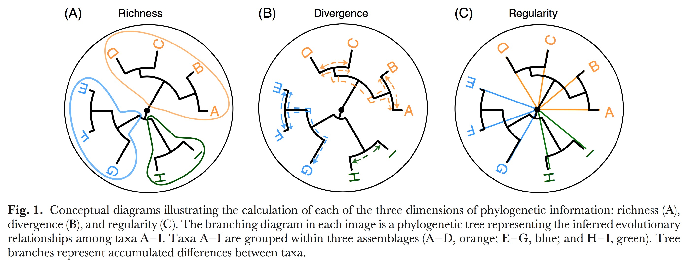
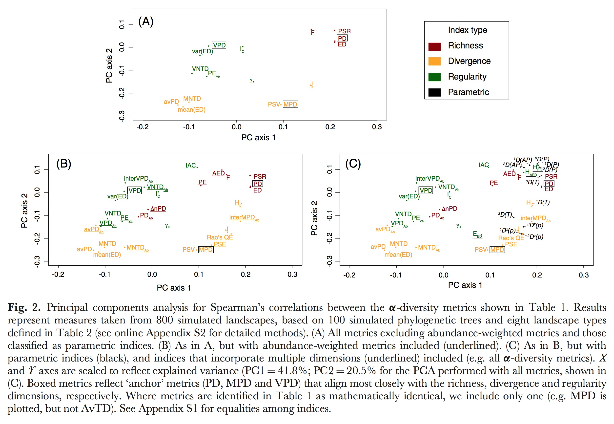
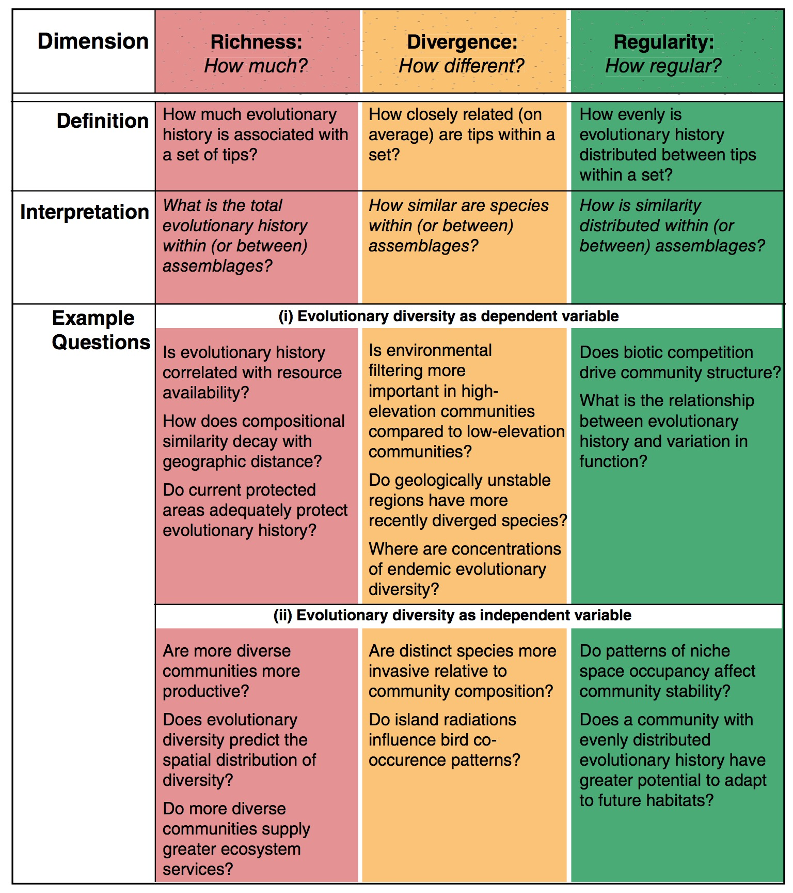
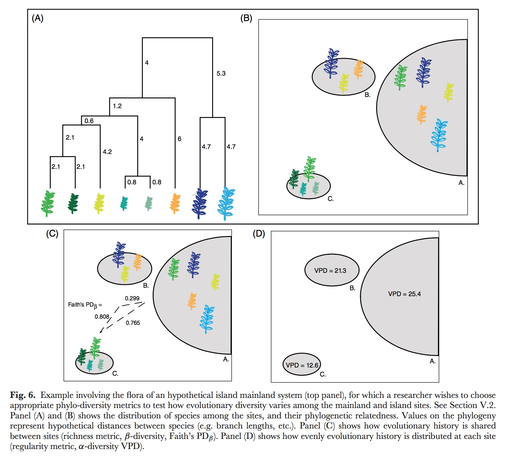

# Module 2: Space and phylogeny summary statistics 
  This is the master document for Module 2, a foundational function in our FARM package that analyzes results from Module 1, the other foundational function. Module 1 simulates a spatial pattern and a phylogenetic tree given a set of environmental and inheritance rules and then Module 2 summarizes those simulated results using a large set of targeted summary statistics. Here we describe our choice of summary statistics, justify those choices as part of a larger theoretical context, and provide our reproducable code for executing the anaylses yourself. These two parts are seperated into modules so that they can act independently. An combination of spatial pattern and associated phylogeny many be used as long as they are formatted correctly.         

This pipeline was designed to analyze a simulated world where all the information is known about both the world and the tree. There is no missing information, just extinct trees. This is much different than our real tree that has loads of uncertainty unevenly destributed across it. The result you see demonstrated right now are one simulated result of many. I need to do a sister page to this were we do this entire analysis on the real tree, or best real tree we've got. 

We have four types of data available for asking research questions using D-place data: [phylogenies](#phylogenetic-summary-statistics), [spatial locations](#spatial-locations), trait identities, and environmental reconstructions. Any one of these four data types alone are relatively information poor, so we are searching for ways to model connections between these data types to draw stronger conclusions overall. 

Other modules can use the summary statistics generated from this module to test hypotheses. We currently have a ABC and Random Forest module started but there will be more to come. 

These are quantitative connections that we are assumed in the analyses, but we don't actually have any support in the data for doing so. 
1. nearest neighbor connectivity measures
2. Abundance estimates
3. Pairwise influence (history) between cultures. 
4. Environmental reconstruction validation evidence 

# Phylogenetic summary statistics  

Whole tree vs. part of tree? These statistics are generally used to compare one sample to another. For example, an experimental contrast between two sites, two phylogenetic groups, or two communities in two different locations. Here we are calculating these statistics for the global langauage tree to compare against global trees created in our simulation. You still retain the ability to subset this tree or others and send only those subsets through this code to compare the values with each other afterwards. 

* Introduction and framework
* [Alpha Diversity metrics](#alpha-diversity-metrics) 
  1. [Branch Length (richness and divergence)](#branch-lengths)
  2. [Pairwise distance between tips (richness, divergence, and regularity)](#pairwise-distance-between-tips)
  3. [Phylogenetic isolation (divergence, and regularity)](#phylogenetic-isolation)
  4. [Nearest Neighbor (divergence, and regularity)](#nearest-phylogenetic-neighbor) 
* [Beta Diversity](#beta-diversity)
* [Tree topology](#tree-topology)
* [Macroevolutionary rates](#macroevolutionary-rates)


All trees are ultrametric.


## Introduction and framework


  The choice of phylogenetic analyses and organizational scheme is based on the suggestions of @Tucker2016. Here are a few images from that paper for an overview:  










```{r}
library(knitr)
library(phytools)
library(FARM)
library(ROCR)
library(spdep)
```


```{r}
load('~/Downloads/download.Rdata')

this_tree <- myOut$mytree
this_world <- myOut$myWorld
```

```{r}
str(this_world)
str(this_tree)
```


##Alpha diversity metrics

### Branch Lengths
  Branch length data is embedded in the tree object provided to this function. The first step in summarizing the lengths is to extract those data from the tree object. These data are called 'edges' in the tree object. We extract branch lengths and create an object called 'Branch_lengths' for passing on to the other summary functions. The histogram below shows the frequency of different branch lengths found throughout the tree. 
  
```{r}
Branch_Lengths <- this_tree$edge.length
```

```{r, echo=FALSE}
 # plot the branch lengths
hist(Branch_Lengths, xlab="Branch Lengths", main="", breaks=1000, border=NA, 
     col=adjustcolor("cornflowerblue", alpha=0.9))
```
We can summarize branch lengths according to normal summary statistics, but it can be difficult to assign evolutionary meaning to some of these metrics and so they are not regularly used as best I can tell. This lack of meaning does not mean that these statistics couldn't be used to distinguish between large simulated trees. 
```{r}
mean_branch_length <- mean(Branch_Lengths)
variance_branch_length <- var(Branch_Lengths)
SD_branch_length <- sd(Branch_Lengths)
```


```{r, echo=FALSE}
paste("mean branch length = ", mean_branch_length)
paste("variance in branch lengths = ", variance_branch_length)
paste("standard deviation in branch lengths = ", SD_branch_length)

```

```{r, echo=FALSE}
par(mar=c(2,4,0,0))
boxplot(Branch_Lengths, col=adjustcolor("cornflowerblue", alpha=0.5), 
        border=adjustcolor("cornflowerblue", alpha=1), ylab="Branch Lengths")
```

#### Phylogenetic diversity ($PD$)
Phylogenetic diversity ($PD$) is the summation ($\sum$) of all branch lengths connecting species together, where $B_{t}$ is the set of included tips and $L_{b}$ is Branch lengths [@Faith1992]. This is an anchor test, which means it is regularly used, well understood, and we should use it to anchor our work to past work. PD is a richness measure, it tells us how much evolutionary history is associated with a set of tips.  

$$PD = \sum_{b \in B_{t}}^{}L_{b}$$
 
```{r}
# Anchor test = PD (Faith's phylogenetic diversity)
Pylo_diversity_is_sum_of_BL <- sum(Branch_Lengths)
Pylo_diversity_is_sum_of_BL
```


 There are variations on this measure that we have NOT implemented here. It is popular to scale this measure according to some ecological driver. @Barker2002 scales branch lengths ($L_{b}$) by multiplying them against the abundance of individuals at at tip ($A_{b}$). Others [@Rosauer2009], scale them by their range size instead ($R_{b}$). 
 
 $$\Delta n PD = \sum_{b \in B_{t}}^{}A_{b}L_{b}$$
$$PE = \sum_{b \in B_{t}}^{}\dfrac{L_{b}}{R_{b}}$$
Argueing that proportional abundance phylogenetic diversity ($PD_{Ab}$) is more effective than the standard PD calculated from raw abundance, @Vellend2011 penned a new version of PD where $B$ is the total number of branch lengths ($L_{b}$). Note: We don't have abundance data right now for the human project so this metric is not currently very helpful.   
$$PD_{Ab} = B * \dfrac{\sum_{b \in B_{t}}^{}A_{b}L_{b}}{\sum_{b \in B_{t}}^{}A_{b}}$$

```{r}
#Calculate B
number_of_branches <- length(Branch_Lengths)
number_of_branches
```

#### Average phylogenetic diversity ($avPD$)
Average phylogenetic diversity ($avPD$) [@Clarke2001] is a branch length-based divergence indices where PD is divided by the total number of tips ($S$) in the tree. 
$$avPD = \dfrac{PD}{S}$$
```{r}
Number_of_tips <- length(this_tree$tip.label)
average_phylogenetic_diversity <- Pylo_diversity_is_sum_of_BL / Number_of_tips
average_phylogenetic_diversity
```


There is also a proportional abundance version of average phylogenetic diversity ($avPD_{Ab}$) [@Tucker2016]. Again, we don't have abundance values yet for D-place. 
$$avPD_{Ab} = \dfrac{B * \dfrac{\sum_{b \in B_{t}}^{}A_{b}L_{b}}{\sum_{b \in B_{t}}^{}A_{b}}}{S}$$


### Pairwise distance between tips

This is the patristic distance, the sum of the branch lengths following the shortest distance between two tips in a tree, implemented as a distance matrix where every tip is compared to every other tip. This distance function can be anything. We use euclidean and environmental distance matrices heavily in the spatial analyses. 

#### Calculate the patristic distance between two taxa, for all taxa
Calculate the patristic distance between two taxa using the R package 'phytools', this function takes a 'phylo' tree object and returns a distance matrix between tips. Need original citation.

```{r}
## Pairwise distance between tips - From library(ape) in library(phytools)
Pairwise_dist <- cophenetic(this_tree)
```
yields a distance matrix (list of 2D matrices) of all distances between taxa.


```{r, echo=FALSE}
str(Pairwise_dist)
```

#### Sum of all pairwise distances ($F$)
Now we can use a set of summary statistics to describe those pairwise distances. The sum of all pairwise distances, $F$, is formally called 'Extensive quadratic entropy'. [@Izsak2000]. Just as it was with branch lengths, this is a richness measure and, accordingly, should be used to answer richness questions. 

$$F = \sum_{i} \sum_{j} d_{ij}$$
```{r}
# F -- Extensive quadratic entropy
F_quadratic_entropy_is_sum_of_PD <- sum(Pairwise_dist)
F_quadratic_entropy_is_sum_of_PD
```

#### Mean pairwise distance (MPD)
Mean inter-species distances. The mean of all pairwise distances, $MPD$ (a.k.a. $AvTD$, and $\Delta^{+}$), is the mean distance between species. [@Clarke1998; @Webb2002; @Webb2008; @Kembel2010].
$$MPD = \dfrac{\sum_{ij} d_{ij}}{S(S-1)}$$

```{r}
# Anchor test = MPD (mean pairwise distance)
Mean_pairwise_distance <- 
  Pairwise_dist / (Number_of_tips * (Number_of_tips - 1) ) 
```

```{r, echo=FALSE}
str(Mean_pairwise_distance)
```

#### MPD anchored to the root 
There is an extention to mean pairwise distance calculations from @Helmus2010 called $PSV$, $PSR$, and $PSE$, phylogenetic species variability, phylogenetic species richness, and phylogenetic species evenness. These measures take the basic pairwise distance calculations and anchor them to the root of the tree so distances have a common denominator. This extention is implemented by using the same equations, just with a constrained set of $d_{ij}$ conditions. Specifically,


$$PSV = MPD = \dfrac{\sum_{ij} d_{ij}}{S(S-1)}$$
$$PSR = \sum_{i} {(\dfrac{1}{S-1} \sum_{j} {d_{ij}})}$$
$$PSE = \dfrac{S}{S-1} \sum_{ij} d_{ij}p_{i}p_{j}$$


with these specific values of $d_{ij}$

$$
d_{ji}=0.5*(c_{ii} + c_{jj} - c_{ij}) \\ 
\ \\
or \\
\ \\
d_{ij} = 1 - c_{ij} / (\sqrt{c_{ii}c_{jj}}) 
$$
and
$$
c_{ii} = the \ sum \ of \ branch \ lengths \ from \ tip \ i  \ to \ the \ root \ of \ the \ phylogenetic \ tree. \\
\ \\
c_{ij} = the \ sum \  of \ branch \ lengths \ from \ first \ common \ ancestor \ for \ i \ and \ j \ to \ the \ root.
$$


#### Average distance between two randomly chosen species
$J$, Intensive quadratic entropy, which is the average distance between two randomly chosen species [@Izsak2000]
$$J = \dfrac{\sum_{ij}d_{ij}}{S^2} $$


#### Simpson's diversity index for pairwise distance
There has been a long effort to pen a phylogenetic analogy to a Simpson's diversity index. [@Rao1982; @Clarke1998; @Pavoine2005; @Hardy2007; @Webb2002; @Webb2008; @Kembel2010]. The conclusion seems to be that this measure is equivilent to scaling $MPD$ by abundance $p_{i}$ and $p_{j}$ to get $MPD_{Ab}$. This is also a special case of Rao's Quadratic Entropy, $Roe's QE$. Note: not using abundance measures yet for D-place data. 

$$MPD_{Ab} = \sum_{i} \sum_{j} d_{ij} p_{i} p_{j}$$


#### Interspecific comparisons of pairwise distances
The interspecific variant (rather than the intraspecific default described above) defines the expected phylogenetic distance between two indivdiuals randomely drawn conditionally on the fact that they indivdulas from different species. 
$$InterMPD_{Ab} = \dfrac{\sum_{i} \sum_{j \ne i} d_{ij} p_{i} p_{j} }{\sum_{i} \sum_{j \ne i} d_{ij} p_{i} p_{j}}  $$


#### Variance in pairwise distances ($VPD$)
Variance in pairwise distances, $VPD$ (a.k.a. $VarTD$ and $\Lambda^+$), is a regularity indices. @Clarke2001 Variance is relative to tips, $S$, not to total branches ($B$ from above). These are the residuals, they compare each individual pairwise connection to the overall mean. 

$$VPD = \dfrac{1}{S(S-1)} (\sum_{i} \sum_{j \ne i} {(d_{ij} - MPD)^2})$$


```{r}
#need to adjust to equation above!

#Pairwise distance/all distances -- Variance of pairwise distances

# Anchor test = VPD (variation of pairwise distance)  

variance_pairwise_distance <- var(as.vector(Pairwise_dist))
```


Variants of $VPD$ are $VPD_{ab}$ and $InterPVD_{Ab}$, where variance is scaled by abundance or compared in and out of species. These are also regularity indices. 

$$
VPD_{Ab}= 
(\sum_{i} \sum_{j} n_{i} n_{j}) *
\dfrac{\sum_{i} \sum_{j} n_{i} n_{j} (d_{ij} - MPD_{Ab})^2}
{(\sum_{i} \sum_{j} n_{i} n_{j})^2 - \sum_{i} \sum_{j} (n_{i} n_{j})^2}
\\
or
\\
InterVPD_{Ab} = 
(\sum_{i} \sum_{j \ne i} n_{i} n_{j}) *
\dfrac{\sum_{i} \sum_{j \ne i} n_{i} n_{j} (d_{ij} - InterMPD_{Ab})^2}
{(\sum_{i} \sum_{j \ne i} n_{i} n_{j})^2 - \sum_{i} \sum_{j \ne i} (n_{i} n_{j})^2}
$$

### Nearest phylogenetic neighbor

#### Divergence indices
Divergence indices using nearest distance: $MNTD$ and $MNTD_{Ab}$, Mean nearest taxon distance and Abundance-weighted MNTD [@Webb2002; @Webb2008; @Kembel2010]. 

$MNTD$, mean nearest taxon distance, is the mean shortest distance from a species to all other in the assemblage [@Webb2002; @Webb2008; @Kembel2010].  
$$
MNTD = 
\dfrac{1}{S}
\sum_{i}
d_{i_{min}}
$$

$MNTD_{AB}$, abundance adjusted mean nearest taxon distance. Adjusted by species proportions (i.e. species' relative abundances) [@Webb2002; @Webb2008; @Kembel2010]   
$$
MNTD_{Ab} = 
\sum_{i=1}^{S}
[d_{i_{min}} * p_{i}]
$$

#### Regularity indices
Regularity indices using nearest distances: $VNTD$, $VNTD_{Ab}$, $PE_{ev}$.  

$VNTD$, Variance in nearest taxon distances, is the variance in nearest pairwise distance [@Tucker2016].
$$
VNTD = \dfrac{1}{S}
\sum_{i-1}^{S}
[(d_{i_{min}} - MNTD)^2]
$$
$VNTD_{Ab}$, Abundance weighted variance in nearest taxon distances, is scales by abundance in the same way as descried above [@Tucker2016].
$$
VNTD_{Ab} = \dfrac
{(\sum_{i} n_{i}) \sum_{i} n_{i} (d_{i_{min}} - MNTD_{Ab})^2}
{(\sum_{i} n_{i})^2 - \sum_{i} n_{i} ^2}
$$

#### Phylogenetic version of the funtional $FE_{ve}$ index
$PE_{ve}$, phylogenetic evenness is a phylogenetic version of the funtional $FE_{ve}$ index. First a minimum spanning tree ($MST$) is computed using the cophenetic distance obtained from the phylogenetic tree. The $MST$ contains $S-1$ Branches connection the $S$ species. We denote $l$ a branch on the $MST$, $dist(i,j)$ is the length the branch $l$ that connects species $i$ and $j$. $n_{i}$ is, as defined above, the abundance of species $i$ in the asseblage [@Villeger2008; @Dehling2014]. 

$$
Weighted \ evenness: \\
EW_{i} = \dfrac{dist(i,j)}
{(n_{i} + n_{j})/(\sum_{k=1}^{S}n_{k})} \\
\ \\
Partial \ weighted \ evenness: \\ 
PEW_{l} = \dfrac
{EW_{l}}
{\sum_{l=1}^{S-1} EW_{l}} \\
\ \\
Phylogenetic \ evenness: \\
PE_{ve} = \dfrac
{\sum_{l=1}^{S-1} min(PEW_{l}, \dfrac{1}{S-1}) - (\dfrac{1}{S-1})}
{1- (\dfrac{1}{S-1})}
$$

### Phylogenetic isolation
A phylogenetic isolation index represents the relative isolation of a given species within a phylogenetic tree. Several indices have been proposed so far but we focus here on the evolutionary distinctiveness index called ‘Fair Proportion’ as proposed by @Redding2003 and @Isaac2007. 

#### Evolutionary distinctiveness (richness indices)
$ED$, evolutionary distinctiveness is a richness indices. NOTE: not equal to Faith's PD because the $ED_{i}$ are computed from the regional pool of species and sumed across a given assemblage (i.e. a subset of the regional species pool) [@Tucker2016; @Safi2013a; @Redding2003; @Isaac2007]. 

$$
  ED = \sum_{i}ED_{i} \\
  \ \\ 
  where \ ED_{i} = \sum_{b \in B_{t_{i}}} \dfrac{L_{b}}{S_{b}} 
$$

$AED$, Abundance-weighted $ED$ [@Tucker2016; @Cadotte2010]. 
$$
\sum_{i} AED_{i} \\
\ \\
where \ AED_{i} = \sum_{b \in B_{t_{i}}} \dfrac{L_{b}}{A_{b} }* p_{i}
$$


```{r}

# Bruno's function for ED. Provided in library(FARM)

evol.distinct2 <- function (tree, type = c("equal.splits", "fair.proportion"), 
    scale = FALSE, use.branch.lengths = TRUE) 
{
    type <- match.arg(type)
    if (is.rooted(tree) == FALSE) 
        warning("A rooted phylogeny is required for meaningful output of this function", 
            call. = FALSE)
    if (scale == TRUE) {
        if (is.ultrametric(tree) == TRUE) 
            tree$edge.length <- tree$edge.length/(as.numeric(branching.times(tree)[1]))
        else tree$edge.length <- tree$edge.length/sum(tree$edge.length)
    }
    if (use.branch.lengths == FALSE) 
        tree$edge.length <- rep(1, length(tree$edge.length))
    for (i in 1:length(tree$tip.label)) {
        spp <- tree$tip.label[i]
        nodes <- .get.nodes(tree, spp)
        nodes <- nodes[1:(length(nodes) - 1)]
        internal.brlen <- tree$edge.length[which(tree$edge[, 
            2] %in% nodes)]
        if (length(internal.brlen) != 0) {
            internal.brlen <- internal.brlen * switch(type, equal.splits = sort(rep(0.5, 
                length(internal.brlen))^c(1:length(internal.brlen))), 
                fair.proportion = {
                  for (j in 1:length(nodes)) {
                    sons <- .node.desc(tree, nodes[j])
                    n.descendents <- length(sons$tips)
                    if (j == 1) portion <- n.descendents else portion <- c(n.descendents, 
                      portion)
                  }
                  1/portion
                })
        }
        ED <- sum(internal.brlen, tree$edge.length[which.edge(tree, 
            spp)])
        if (i == 1) 
            w <- ED
        else w <- c(w, ED)
    }
    return(w)
}

```

Evolutionary distinctiveness is our basic measure of phylogenetic isolation. #This should likely be 'fair proportions' instead of 'equal.splits'.


```{r}

# Calculate ED
# Using equal.splits method, faster computation
# Evolutionary_distinctiveness_i <- evol.distinct2(this_tree, type = "equal.splits")  

# ED - Summed evolutionary distinctiveness
# Evolutionary_distinctiveness_sum <- sum(Evolutionary_distinctiveness_i)
```


```{r}
#Evolutionary_distinctiveness_sum
```


We can run some standard summary statistics (mean and variance) on this ED measure. var(Ed) shows up close to VPD on the PCAs in the intro [@Tucker2016].

```{r}
# mean(ED)
# mean_Phylogenetic_isolation <- mean(Evolutionary_distinctiveness_i)

# var(ED)
#variance_Phylogenetic_isolation <- var(Evolutionary_distinctiveness_i)
```


```{r}
#mean_Phylogenetic_isolation
#variance_Phylogenetic_isolation
```

#### Mean evolutionary distinctiveness (divergence indices)
The divergence indices version for $ED$ is mean evolutionary distinctiveness, $MED$. The mean of evolutionary distinctiveness [@Redding2003; @Isaac2007]. 
$$
MED = \dfrac
{\sum_{i} ED_{i}}
{S} \\
\ \\
with \\
\ \\
ED_{i} = \sum_{b \in B_{t_{i}}} \dfrac{L_{b}}{S_{b}}
$$
#### Entropy measure of evolutonary distinctiveness (regularity indices)
The regularity indices for $ED$/phylogenetic isolation are $H_{ED}$, $E_{ED}$, $var(ED)$, $H_{AED}$

$H_{ED}$, Entropy measure of evolutionary distinctiveness, is the shannon index applied to evolutionary distinctiveness values [@Cadotte2010]. 
$$
H_{ED} = -\sum_{i=1}^{S}
((\dfrac{ED_{i}}{\sum_{i=1}^{S} ED_{i}})
* \ln (\dfrac{ED_{i}}{\sum_{i=1}^{S} ED_{i}}))
$$

$E_{ED}$, Equitability of evolutionary distinctiveness, is $H_{ED}$ controlled for species richness [@Cadotte2010]. 

$$
E_{ED} = \dfrac{H_{ED}}{\ln(S)}
$$
$var(ED)$, Variance in evolutinoary distinctiveness, is the variance of species evolutionary distinctiveness [@Tucker2016]. 

$$
var(ED) = \dfrac{1}{S-1} *
\sum_{i=1}^{S}
(ED_{i}-\dfrac{\sum_{i=1}^{S} ED_{i}}{S})^2
$$
$H_{ED_{Ab}}$, Abundance-weighted version of $H_{ED}$ [@Cadotte2010].

$$
H_{ED_{Ab}} = -\sum_{i=1}^{S}
(\dfrac{n_{i}AED_{i}}{\sum_{i=1}^{S} n_{i}AED_{i}} *
\ln(\dfrac{n_{i}AED_{i}}{\sum_{i=1}^{S} n_{i}AED_{i}}))
$$


## Beta diversity
We currently are not using any beta diversity metrics but there are many to choose from if we decide to add them later. 


## Tree topology
Tree topology is a measure of the shape of the overall tree. The tree can be lopsided side-to-side or front-to-back. 

Our most trusted index for the tippy vs trunky of a tree is the gamma index, $\gamma$.The index characterizes the distribution of branching events within the tree. Trees with $\gamma < 0$ have relatively longer branches towards the tips of the phylogeny (tippy trees), whereas trees with $\gamma > 0$ have relatively longer inter-nodal distances towards the root of the phylogeny (stemmy trees).  tk represents an ‘evolutionary period’ (limits are given by two speciation events) or equivalently an internode distance [@Pybus2000]. 

$$
  \gamma = \dfrac
  {(\dfrac{1}{S-2}* \sum_{i=2}^{S-1} (\sum_{k=2}^{i} Kt_{k}))- \dfrac{1}{2} * \sum_{j=2}^{S} jt_{j}}
  {(\sum_{j=2}^{S} jt_{j}) * \sqrt{\dfrac{1}{12*(S-2)}}}
$$


```{r eval=FALSE}
# ltt function from library(phytools)
ltt <- function (tree, plot = TRUE, drop.extinct = FALSE, log.lineages = TRUE, 
    gamma = TRUE, ...) 
{
    tol <- 1e-06
    if (!inherits(tree, "phylo") && !inherits(tree, "multiPhylo")) 
        stop("tree must be object of class \"phylo\" or \"multiPhylo\".")
    if (inherits(tree, "multiPhylo")) {
        obj <- lapply(tree, ltt, plot = FALSE, drop.extinct = drop.extinct, 
            log.lineages = log.lineages, gamma = gamma)
        class(obj) <- "multiLtt"
    }
    else {
        tree <- reorder.phylo(tree, order = "cladewise")
        if (!is.null(tree$node.label)) {
            node.names <- setNames(tree$node.label, 1:tree$Nnode + 
                Ntip(tree))
            tree$node.label <- NULL
        }
        else node.names <- NULL
        if (is.ultrametric(tree)) {
            h <- max(nodeHeights(tree))
            time <- c(0, h - sort(branching.times(tree), decreasing = TRUE), 
                h)
            nodes <- as.numeric(names(time)[2:(length(time) - 
                1)])
            ltt <- c(cumsum(c(1, sapply(nodes, function(x, y) sum(y == 
                x) - 1, y = tree$edge[, 1]))), length(tree$tip.label))
            names(ltt) <- names(time)
        }
        else {
            drop.extinct.tips <- function(phy) {
                temp <- diag(vcv(phy))
                if (length(temp[temp < (max(temp) - tol)]) > 
                  0) 
                  pruned.phy <- drop.tip(phy, names(temp[temp < 
                    (max(temp) - tol)]))
                else pruned.phy <- phy
                return(pruned.phy)
            }
            if (drop.extinct == TRUE) 
                tree <- drop.extinct.tips(tree)
            root <- length(tree$tip) + 1
            node.height <- matrix(NA, nrow(tree$edge), 2)
            for (i in 1:nrow(tree$edge)) {
                if (tree$edge[i, 1] == root) {
                  node.height[i, 1] <- 0
                  node.height[i, 2] <- tree$edge.length[i]
                }
                else {
                  node.height[i, 1] <- node.height[match(tree$edge[i, 
                    1], tree$edge[, 2]), 2]
                  node.height[i, 2] <- node.height[i, 1] + tree$edge.length[i]
                }
            }
            ltt <- vector()
            tree.length <- max(node.height)
            n.extinct <- sum(node.height[tree$edge[, 2] <= length(tree$tip), 
                2] < (tree.length - tol))
            node.height[tree$edge[, 2] <= length(tree$tip), 2] <- node.height[tree$edge[, 
                2] <= length(tree$tip), 2] + 1.1 * tol
            time <- c(0, node.height[, 2])
            names(time) <- as.character(c(root, tree$edge[, 2]))
            temp <- vector()
            time <- time[order(time)]
            time <- time[1:(tree$Nnode + n.extinct + 1)]
            for (i in 1:(length(time) - 1)) {
                ltt[i] <- 0
                for (j in 1:nrow(node.height)) ltt[i] <- ltt[i] + 
                  (time[i] >= (node.height[j, 1] - tol) && time[i] <= 
                    (node.height[j, 2] - tol))
            }
            ltt[i + 1] <- 0
            for (j in 1:nrow(node.height)) ltt[i + 1] <- ltt[i + 
                1] + (time[i + 1] <= (node.height[j, 2] + tol))
            names(ltt) <- names(time)
            ltt <- c(1, ltt)
            time <- c(0, time)
            time[length(time)] <- time[length(time)] - 1.1 * 
                tol
        }
        if (!is.null(node.names)) {
            nn <- sapply(names(time), function(x, y) if (any(names(y) == 
                x)) 
                y[which(names(y) == x)]
            else "", y = node.names)
            names(ltt) <- names(time) <- nn
        }
        if (gamma == FALSE) {
            obj <- list(ltt = ltt, times = time, tree = tree)
            class(obj) <- "ltt"
        }
        else {
            gam <- gammatest(list(ltt = ltt, times = time))
            obj <- list(ltt = ltt, times = time, gamma = gam$gamma, 
                p = gam$p, tree = tree)
            class(obj) <- "ltt"
        }
    }
    if (plot) 
        plot(obj, log.lineages = log.lineages, ...)
    obj
}
<environment: namespace:phytools>
```


```{r}
ltts <- ltt(this_tree, gamma = TRUE, plot = FALSE)
ltts
str(ltts)
```


```{r}
lineages_through_time <- as.numeric(ltts[[1]])
time_steps <- as.numeric(ltts[[2]])
#extract Gamma index
gamma <- ltts[[3]]
gamma_p_value <- ltts[[4]]
```


```{r}
lineages_through_time 
time_steps 
gamma 
gamma_p_value 
```


There are two other regularly used metrics that include abundance measures. Note: we don't have abundance measures for D-place data. 

$IAC$, imbalance of abundance at the clade level, quantifies the relative deviation in the abundance distribution from a null case where individuals are evenly partitioned between clade splits. $v$ is the number of nodes in the phylogenetic tree.  $n_{i}$ is, as defined above, the abundance of species $i$ in the assemblage.  $\eta_{k}$ is the expected abundance species $i$ would have if the abundance was randomly split among lineages in the phylogenetic tree at each speciation event.  is the number of lineages originating at node $k$ in the set $s(k,root)$, which contains the nodes located on the path between node $k$ and the root of the phylogenetic tree. N is the total assemblage abundance [@Cadotte2010]. 

$$
\dfrac{\sum_{i=1}^{S}  |n_{i} - \hat{n_{i}}|}
{v} \\
\ \\
where \\ 
\ \\
\hat{n_{i}} = \dfrac{N}{\prod_{K \in s(i, root)}\eta_{k}}
$$

$I_{c}$, the Colless index, is the sum of the absolute differences in species richness between sister-clades at each internal node. For fully resolved trees, each internal node defines two sister-clades. $S_{1k}$ is the number of species descending from the first clade defined by node k and $S_{2k}$ that of the second clade. $v$ is, as defined above, the number of nodes in the phylogenetic [@Colless1982]. 

$$
I_{c} = \sum_{k=1}^{v} |S_{1k} - S_{2k}|
$$


## Macroevolutionary rates

```{r }

#function name = bd, function input = tree of type 'phylo'
bd <- function (tree) 
{
    tree$edge.length <- tree$edge.length/max(tree$edge.length)
    x <- birthdeath(tree)
    b <- x$para[2]/(1 - x$para[1])
    d <- b - x$para[2]
    c(setNames(c(b, d), c("b", "d")), x$para)
}


```


```{r}
 ## Speciation vs extinction rates and Net diversification
bds <- bd(this_tree)
speciation_rate <- bds[1]
extinction_rate <- bds[2]
extinction_per_speciation <- bds[3]
speciation_minus_extinction <- bds[4]
  
```


```{r}
## Speciation vs extinction rates and Net diversification dependent on trait
# N.for.dom <- table(this_world[, 6])
#    if(length(N.for.dom) == 2) {
par.div.dep <- DivDep( mytree = this_tree, myWorld = this_world)
trait_1_speciation <- par.div.dep[1]
trait_2_speciation <- par.div.dep[2]
trait_1_extinction <- par.div.dep[3]
trait_2_extinction <- par.div.dep[4]
transition_from_trait_1_to_2 <- par.div.dep[5]
transition_from_trait_2_to_1 <- par.div.dep[6]
transition_rate_ratio_1to2_over_2to1 <- transition_from_trait_1_to_2/transition_from_trait_2_to_1
      
```


```{r}

## Crown age per trait AUC and effect size
tip.length <- this_tree$edge.length[this_tree$edge[, 2] %in% 1:Ntip(this_tree)]
tip.length <- (tip.length - min(tip.length)) / (max(tip.length) - min(tip.length))
this_trait <- this_world[match(this_tree$tip.label, this_world[, 8]), 6]
tip.length.2 <- tip.length[this_trait == 2]
tip.length.1 <- tip.length[this_trait == 1]
model <- glm(as.factor(this_trait) ~ log(tip.length + 1),
             family = "binomial")
effect.size <- model$coefficients[2]
# plot(y = this_trait - 1, x= log(tip.length))
p <- predict(model, as.factor(this_trait), type = "resp")
# points(y = p, x = log(tip.length), col = "red")
pr <- prediction(p, as.factor(this_trait))
auc.model <- performance(pr, measure = "auc")@y.values[[1]]

```


```{r}
## Phylogenetic signal (D)
Phylogenetic_signal <- Dsig(mytree = this_tree, myWorld = this_world)

```


# Spatial Locations

```{r}

## Spatial Analysis
nbs0 <- knearneigh(as.matrix(this_world[, 2:3]), k = 7, longlat = TRUE)
nbs <- knn2nb(nbs0, sym = TRUE) # 7 symmetric neighbors
nbs.listw <- nb2listw(nbs)
factors.nbs <- as.factor(ifelse(is.na(this_world[, 6]), 3, this_world[, 6]))
spatial.tests <- joincount.test(fx = factors.nbs, listw = nbs.listw)
spatial.tests.fora <- spatial.tests[[1]]$statistic
spatial.tests.dom <- spatial.tests[[2]]$statistic
#prevalence <- (N.for.dom[1] - N.for.dom[2]) / sum(N.for.dom)
```


```{r}
results_summary_matrix_1 <- cbind(

        number_of_branches,
        #Pylo_diversity_is_sum_of_BL,
        #average_phylogenetic_diversity_is_mean_of_BL,
        #variance_Pylo_diversity_is_variance_of_BL,

        F_quadratic_entropy_is_sum_of_PD,
        Mean_pairwise_distance,
        variance_pairwise_distance,

        #Evolutionary_distinctiveness_sum,
        #mean_Phylogenetic_isolation,
        #variance_Phylogenetic_isolation,

        gamma,
        gamma_p_value,
        speciation_rate,
        extinction_rate,
        extinction_per_speciation,
        speciation_minus_extinction,
        trait_1_speciation,
        trait_2_speciation ,
        trait_1_extinction ,
        trait_2_extinction ,
        transition_from_trait_1_to_2 ,
        transition_from_trait_2_to_1 ,
        transition_rate_ratio_1to2_over_2to1 ,
        Phylogenetic_signal,
        spatial.tests.fora,
        spatial.tests.dom,
       # prevalence,
       # auc.model,
        effect.size
      )
      #rownames(results_summary_matrix_1) <- 1

      #results_summary_matrix_2 <- cbind(
      #  c(Evolutionary_distinctiveness,NA),
      #  lineages_through_time,
      #  time_steps
      #)
      #colnames(results_summary_matrix_2) <- c("Evolutionary_distinctiveness", "lineages_through_time", "time_steps")
      #head(results_summary_matrix_2)

      ### Returns from function in list form
      #returns <- list(
        #Branch_Lengths,
        #Pairwise_dist,
      #  results_summary_matrix_1,
      #  results_summary_matrix_2

      #)

      #names(returns) <- c(
        #"Branch_Lengths",
        #"Pairwise_distance",
       # "results_summary_of_single_value_outputs",
       # "results_summary_matrix_of_multi_value_outputs"
      #)
      
      
```


## Module2() returns these two matrices as a list 


```{r, echo=FALSE}
#kable(returns$results_summary_of_single_value_outputs, caption= "This is our world")
     
```


```{r, echo=FALSE}
 #kable(returns$results_summary_matrix_of_multi_value_outputs, caption= "This is our world")
```


# Here is the exact version in R
```{r eval=FALSE}
## This module analyzes the results from module 1 and returns a list based on how many values each stat returns
## Ty Tuff and Bruno Vilela
## 24 August 2016

###### Specify function ##############################

Module_2 <- function(Module_1_output) {
  cat("\nAnalyzing: 0% [")
  if (any(is.na(Module_1_output))) {
    cat("----------]")
    return(NA)
  } else {

    this_tree <- Module_1_output$mytree
    this_world <- Module_1_output$myWorld


    ##### (0) Pull necessary variables from simulated trees and organize into a single object for all the tests below to pull from.

    #str(all_trees)
    #str(this_tree)


    ## 0a) Branch lengths
    Branch_Lengths <- this_tree$edge.length
    number_of_branches <- length(Branch_Lengths)

    # Anchor test = PD (Faith's phylogenetic diversity)
    Pylo_diversity_is_sum_of_BL <- sum(Branch_Lengths)

    # avPD -- Average phylogenetic diversity
    average_phylogenetic_diversity_is_mean_of_BL <- mean(Branch_Lengths)

    variance_Pylo_diversity_is_variance_of_BL <- var(Branch_Lengths)
    cat("-")
    ## 0b) Pairwise distance between tips
    Pairwise_dist <- cophenetic.phylo(this_tree)
    cat("-")
    # 2b) Pairwise distance -- Sum of pairwise distances

    # F -- Extensive quadratic entropy
    F_quadratic_entropy_is_sum_of_PD <- sum(Pairwise_dist)

    #Mean inter-species distances

    # Anchor test = MPD (mean pairwise distance)

    Mean_pairwise_distance <- mean(Pairwise_dist)

    cat("-")
    #Pairwise distance/all distances -- Variance of pairwise distances

    # Anchor test = VPD (variation of pairwise distance)

    variance_pairwise_distance <- var(as.vector(Pairwise_dist))


    ## 0c) Phylogenetic isolation

    # Using equal.splits method, faster computation
    Evolutionary_distinctiveness <- evol.distinct2(this_tree, type = "fair.proportion")
    cat("-")
    # ED - Summed evolutionary distinctiveness

    Evolutionary_distinctiveness_sum <- sum(Evolutionary_distinctiveness)

    ## 3d) Phylogenetic isolation -- Mean of species evolutionary distinctiveness

    # mean(ED)

    mean_Phylogenetic_isolation <- mean(Evolutionary_distinctiveness)

    ## 4d) Phylogenetic isolation -- Variance of species isolation metrics

    #var(ED)

    variance_Phylogenetic_isolation <- var(Evolutionary_distinctiveness)
    cat("-")

    ## Tree topology

    #Gamma index

    ltts <- ltt(this_tree, gamma = TRUE, plot = FALSE)
    lineages_through_time <- as.numeric(ltts[[1]])
    time_steps <- as.numeric(ltts[[2]])
    gamma <- ltts[[3]]
    gamma_p_value <- ltts[[4]]
    cat("-")

    colless_stat <- colless(as.treeshape(this_tree))
    sackin_index <- sackin(as.treeshape(this_tree))
    tree_shape_stat <- shape.statistic(as.treeshape(this_tree))

    ##### (5) Tree metric -- Macroevolutionary - Rate and rate changes ###############
    ##################################################

    ## Speciation vs extinction rates and Net diversification
    bds <- bd(this_tree)
    speciation_rate <- bds[1]
    extinction_rate <- bds[2]
    extinction_per_speciation <- bds[3]
    speciation_minus_extinction <- bds[4]
    cat("-")


    ## Speciation vs extinction rates and Net diversification dependent on trait
    N.for.dom <- table(this_world[, 6])
    if(length(N.for.dom) == 2) {
      par.div.dep <- DivDep( mytree = this_tree, myWorld = this_world)
      trait_1_speciation <- par.div.dep[1]
      trait_2_speciation <- par.div.dep[2]
      trait_1_extinction <- par.div.dep[3]
      trait_2_extinction <- par.div.dep[4]
      transition_from_trait_1_to_2 <- par.div.dep[5]
      transition_from_trait_2_to_1 <- par.div.dep[6]
      transition_rate_ratio_1to2_over_2to1 <- transition_from_trait_1_to_2/transition_from_trait_2_to_1
      cat("-")

      ## Phylogenetic signal (D)
      Phylogenetic_signal <- Dsig(mytree = this_tree, myWorld = this_world)
      cat("-")

      ## Spatial Analysis
      nbs0 <- knearneigh(as.matrix(this_world[, 2:3]), k = 7, longlat = TRUE)
      nbs <- knn2nb(nbs0, sym = TRUE) # 7 symmetric neighbors
      nbs.listw <- nb2listw(nbs)
      factors.nbs <- as.factor(ifelse(is.na(this_world[, 6]), 3, this_world[, 6]))
      spatial.tests <- joincount.test(fx = factors.nbs, listw = nbs.listw)
      spatial.tests.fora <- spatial.tests[[1]]$statistic
      spatial.tests.dom <- spatial.tests[[2]]$statistic
      prevalence <- (N.for.dom[1] - N.for.dom[2]) / sum(N.for.dom)
      cat("-")
    } else {
      trait_1_speciation <- NA
      trait_2_speciation <- NA
      trait_1_extinction <- NA
      trait_2_extinction <- NA
      transition_from_trait_1_to_2 <- NA
      transition_from_trait_2_to_1 <- NA
      transition_rate_ratio_1to2_over_2to1 <- NA
      Phylogenetic_signal <- NA
      spatial.tests.fora <- NA
      spatial.tests.dom <- NA
      prevalence <- ifelse(names(table(this_world[, 6])[1]) == "1", 1,
                           -1)
      cat("---")

    }


    results_summary_matrix_1 <- cbind(

      number_of_branches,
      Pylo_diversity_is_sum_of_BL,
      average_phylogenetic_diversity_is_mean_of_BL,
      variance_Pylo_diversity_is_variance_of_BL,

      F_quadratic_entropy_is_sum_of_PD,
      Mean_pairwise_distance,
      variance_pairwise_distance,

      colless_stat ,
      sackin_index ,
      tree_shape_stat,

      Evolutionary_distinctiveness_sum,
      mean_Phylogenetic_isolation,
      variance_Phylogenetic_isolation,

      gamma,
      gamma_p_value,
      speciation_rate,
      extinction_rate,
      extinction_per_speciation,
      speciation_minus_extinction,
      trait_1_speciation,
      trait_2_speciation ,
      trait_1_extinction ,
      trait_2_extinction ,
      transition_from_trait_1_to_2 ,
      transition_from_trait_2_to_1 ,
      transition_rate_ratio_1to2_over_2to1 ,
      Phylogenetic_signal,
      spatial.tests.fora,
      spatial.tests.dom,
      prevalence
    )
    rownames(results_summary_matrix_1) <- 1

    results_summary_matrix_2 <- cbind(
      c(Evolutionary_distinctiveness,NA),
      lineages_through_time,
      time_steps
    )
    colnames(results_summary_matrix_2) <- c("Evolutionary_distinctiveness",
                                            "lineages_through_time", "time_steps")
    head(results_summary_matrix_2)

    ### Returns from function in list form
    returns <- list(
      #Branch_Lengths,
      #Pairwise_dist,
      results_summary_matrix_1,
      results_summary_matrix_2

    )

    names(returns) <- c(
      #"Branch_Lengths",
      #"Pairwise_distance",
      "results_summary_of_single_value_outputs",
      "results_summary_matrix_of_multi_value_outputs"
    )
    cat("] 100%")

    return(returns)

  }
}


#Module_2(myOut)

```


## References


