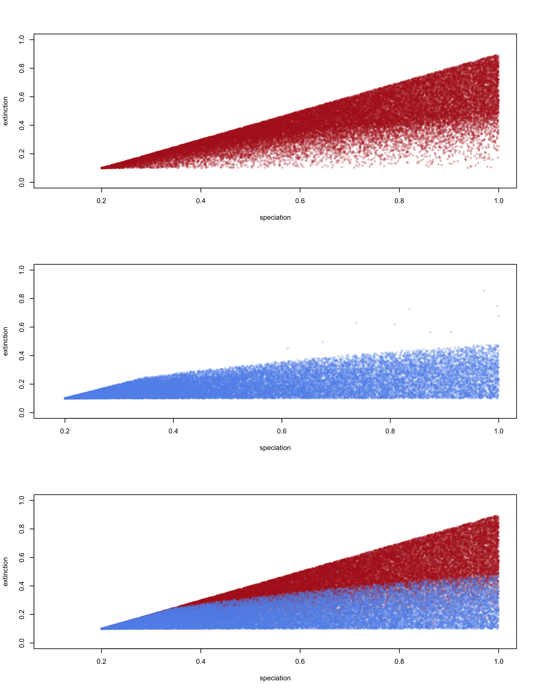
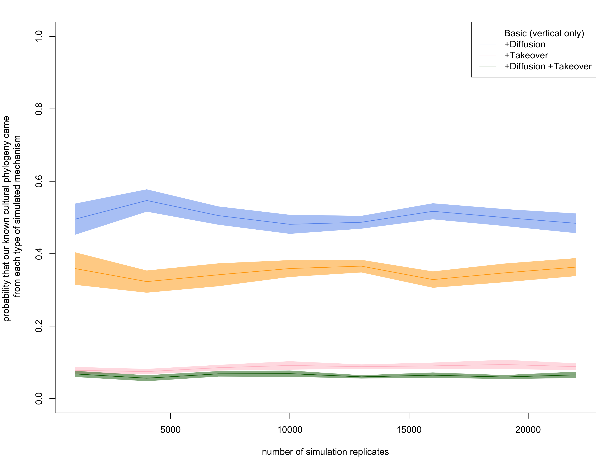

```{r}
library(png)
```


```{r}
## First consolidate the available files into a single table
    
      path <- "~/Box Sync/Four model compare/Module 2"
           
     
           setwd(path)
    myfiles_full <- list.dirs()
    analyze_this_many <- length(myfiles_full)
    
    available_files <- matrix(NA, 1, 1)
    
        
    for(i in 1: analyze_this_many){
    available_files <- rbind(available_files , as.matrix(list.files(myfiles_full[i], full.names = TRUE)))
    }
    dim(available_files)
    
    split.file.name <- strsplit(available_files[10], split = "_") 
    
    
    
 
available <- list.files()
files <- matrix(rep(NA, 62), length(available), 62)
dim(files)
i <- 10


for(i in 1:length(available)){
load(available[i])
name <- unlist(strsplit(available[i], split="_"))
files[i,] <- c(as.vector(matrix(name, 1,35)),matrix(Sim_statistics[[1]], 1, 27))

}


colnames(files) <-  c(

	NA,
	"background_takeover_type" ,
	NA,
	"replicate",
	NA,
	"Model_type",
	rep(NA,2),
	"speciation_of_Env_NonD",
	"speciation_of_Env_D",
	"speciation_of_For",
	"speciation_of_Dom",
	NA,
	"extinction_of_Env_NonD",
	"extinction_of_Env_D",
	"extinction_of_For",
	"extinction_of_Dom",
	NA,
	"P.diffusion_Target_forager",
	"P.diffusion_Target_domesticator",
	"P.diffusion_Source_forager",
	"P.diffusion_Source_domesticator",
	NA,
	"P.takeover_Target_forager",
	"P.takeover_Target_domesticator",
	"P.takeover_Source_forager",
	"P.takeover_Source_domesticator",
	NA,
	"arisal_of_Env_NonD",
	"arisal_of_Env_D",
	"arisal_of_For",
	"arisal_of_Dom",
	
	NA, 
	"timesteps", 
	NA,
        
    "number_of_branches",
	"Pylo_diversity_is_sum_of_BL",
	"average_phylogenetic_diversity_is_mean_of_BL",
	"variance_Pylo_diversity_is_variance_of_BL",

	"F_quadratic_entropy_is_sum_of_PD",
	"Mean_pairwise_distance",
	"variance_pairwise_distance",

	"Evolutionary_distinctiveness_sum",
	"mean_Phylogenetic_isolation",
	"variance_Phylogenetic_isolation",

	"gamma",
	"gamma_p_value",
	"speciation_rate",
	"extinction_rate",
	"extinction_per_speciation",
	"speciation_minus_extinction",
	"trait_1_speciation",
  	"trait_2_speciation" ,
  	"trait_1_extinction" ,
  	"trait_2_extinction" ,
  	"transition_from_trait_1_to_2" ,
  	"transition_from_trait_2_to_1" ,
  	"transition_rate_ratio_1to2_over_2to1" ,
  	"Phylogenetic_signal",
  	"spatial.tests.fora",
  	"spatial.tests.dom",
  	"prevalence"
  	
    
  )

results_table <- as.data.frame(files)
head(results_table)
dim(results_table)
Concatenated_data <- results_table
save(Concatenated_data, file="~/Desktop/Four_model_compare_results.Rdata")

one <- subset(results_table, Model_type=="01" )
two <- subset(results_table, Model_type=="02" )
three <- subset(results_table, Model_type=="03" )
four <- subset(results_table, Model_type=="04" )
crop <- min(length(one[,1]),
length(two[,1]),
length(three[,1]),
length(four[,1]))
one <- one[1:crop,]
two <- two[1:crop,]
three <- three[1:crop,]
four <- four[1:crop,]

Concatenated_data <- rbind(one, two, three, four)
dim(Concatenated_data)


save(Concatenated_data, file=paste0("~/Box Sync/colliding ranges/Simulations_humans/Results/available daily summaries/Four_model_compare_results", format(Sys.time(), format="%d_%b_%Y"),"_crop_to_", crop,".Rdata"))
crop

```


```{r}
## First consolidate the available files into a single table
    
      path <- "~/Box Sync/Four model compare/Module 2 extinct"
           
     
           setwd(path)
    myfiles_full <- list.dirs()
    analyze_this_many <- length(myfiles_full)
    
    available_files <- matrix(NA, 1, 1)
    
        
    for(i in 1: analyze_this_many){
    available_files <- rbind(available_files , as.matrix(list.files(myfiles_full[i], full.names = TRUE)))
    }
    dim(available_files)
    
    split.file.name <- strsplit(available_files[10], split = "_") 
    
    
    
 
available <- list.files()
files <- matrix(rep(NA, 62), length(available), 62)
dim(files)
i <- 10


for(i in 1:length(available)){
load(available[i])
name <- unlist(strsplit(available[i], split="_"))
files[i,] <- c(as.vector(matrix(name, 1,35)),matrix(Sim_statistics[[1]], 1, 27))

}


colnames(files) <-  c(

	NA,
	"background_takeover_type" ,
	NA,
	"replicate",
	NA,
	"Model_type",
	rep(NA,2),
	"speciation_of_Env_NonD",
	"speciation_of_Env_D",
	"speciation_of_For",
	"speciation_of_Dom",
	NA,
	"extinction_of_Env_NonD",
	"extinction_of_Env_D",
	"extinction_of_For",
	"extinction_of_Dom",
	NA,
	"P.diffusion_Target_forager",
	"P.diffusion_Target_domesticator",
	"P.diffusion_Source_forager",
	"P.diffusion_Source_domesticator",
	NA,
	"P.takeover_Target_forager",
	"P.takeover_Target_domesticator",
	"P.takeover_Source_forager",
	"P.takeover_Source_domesticator",
	NA,
	"arisal_of_Env_NonD",
	"arisal_of_Env_D",
	"arisal_of_For",
	"arisal_of_Dom",
	
	NA, 
	"timesteps", 
	NA,
        
    "number_of_branches",
	"Pylo_diversity_is_sum_of_BL",
	"average_phylogenetic_diversity_is_mean_of_BL",
	"variance_Pylo_diversity_is_variance_of_BL",

	"F_quadratic_entropy_is_sum_of_PD",
	"Mean_pairwise_distance",
	"variance_pairwise_distance",

	"Evolutionary_distinctiveness_sum",
	"mean_Phylogenetic_isolation",
	"variance_Phylogenetic_isolation",

	"gamma",
	"gamma_p_value",
	"speciation_rate",
	"extinction_rate",
	"extinction_per_speciation",
	"speciation_minus_extinction",
	"trait_1_speciation",
  	"trait_2_speciation" ,
  	"trait_1_extinction" ,
  	"trait_2_extinction" ,
  	"transition_from_trait_1_to_2" ,
  	"transition_from_trait_2_to_1" ,
  	"transition_rate_ratio_1to2_over_2to1" ,
  	"Phylogenetic_signal",
  	"spatial.tests.fora",
  	"spatial.tests.dom",
  	"prevalence"
  	
    
  )

Concatenated_data <- as.data.frame(files)
head(Concatenated_data)
dim(Concatenated_data)

save(Concatenated_data, file=paste0("~/Box Sync/colliding ranges/Simulations_humans/Results/available daily summaries/Four_model_compare_results_extinct_", format(Sys.time(), format="%d_%b_%Y"),"_crop_to_", crop,".Rdata"))

```


```{r}
load('~/Box Sync/colliding ranges/Simulations_humans/Results/available daily summaries/Four_model_compare_results_27_Feb_2017_crop_to_2861.Rdata')
extant <- Concatenated_data
extant
```


```{r}
setwd("~/Box Sync/colliding ranges/Simulations_humans/Results/available daily summaries")
details <- file.info(list.files())

trimmed_details <- details[which(list.files() == list.files(pattern = "Four_model_compare_results_extinct*")),]
ord <- order(trimmed_details$mtime, decreasing = TRUE)
rownames(trimmed_details[ord,])[1]
load(rownames(trimmed_details[ord,])[1])
extinct <- Concatenated_data

trimmed_details <- details[which(list.files() != list.files(pattern = "Four_model_compare_results_extinct*")),]
ord <- order(trimmed_details$mtime, decreasing = TRUE)
rownames(trimmed_details[ord,])[1]
load(rownames(trimmed_details[ord,])[1])
extant <- Concatenated_data


```

```{r}
dim(extinct)
dim(extant)
```


```{r}

for(i in c(9,10,11,12,14,15,16,17,19,20,21,22,24,25,26,27,29,30,31,32)){
	extinct[which(is.nan(as.numeric(as.character(extinct[, i]))) == TRUE), i] <- NA
}

for(i in c(9,10,11,12,14,15,16,17,19,20,21,22,24,25,26,27,29,30,31,32)){
	extant[which(is.nan(as.numeric(as.character(extant[, i]))) == TRUE), i] <- NA
}

i <- 19
for(i in c(20,21,24,25,26,27)){
	extinct[which(as.numeric(as.character(extinct[, i])) == 0), i] <- NA
}

for(i in c(20,21,24,25,26,27)){
	extant[which(as.numeric(as.character(extant[, i])) == 0), i] <- NA
}


xlimit <- c(0,1)
ylimit <- c(0,600)
maincex <- 0.9

png(file="Global_success_rate_per_parameter.png", width=8.5, height=11, units="in", res=300)

par(mfrow=c(5,4), mar=c(3,3,3,0))


hist(as.numeric(as.character(extinct[,9])), main="speciation of F in F env", col=adjustcolor("firebrick", alpha=0.7), breaks=100, border=NA, xlim= xlimit, ylim= ylimit, cex.main= maincex)
hist(as.numeric(as.character(extant[,9])), main="speciation of F in F env", col=adjustcolor("cornflowerblue", alpha=0.7), breaks=100, border=NA, xlim= xlimit, ylim= ylimit, cex.main= maincex, add=TRUE)


hist(as.numeric(as.character(extinct[,10])), main="speciation of D in F env", col=adjustcolor("firebrick", alpha= 0.7), breaks=100, border=NA, xlim= xlimit, ylim= ylimit, cex.main= maincex)
hist(as.numeric(as.character(extant[,10])), main="speciation of D in F env", col=adjustcolor("cornflowerblue", alpha= 0.7), breaks=100, border=NA, xlim= xlimit, ylim= ylimit, cex.main= maincex, add=TRUE)


hist(as.numeric(as.character(extinct[,11])), main="speciation of F in D env", col=adjustcolor("firebrick", alpha= 0.7), breaks=100, border=NA, xlim= xlimit, ylim= ylimit, cex.main= maincex)
hist(as.numeric(as.character(extant[,11])), main="speciation of F in D env", col=adjustcolor("cornflowerblue", alpha= 0.7), breaks=100, border=NA, xlim= xlimit, ylim= ylimit, cex.main= maincex, add=TRUE)

hist(as.numeric(as.character(extinct[,12])), main="speciation of D in D env", col=adjustcolor("firebrick", alpha= 0.7), breaks=100, border=NA, xlim= xlimit, ylim= ylimit, cex.main= maincex)
hist(as.numeric(as.character(extant[,12])), main="speciation of D in D env", col=adjustcolor("cornflowerblue", alpha= 0.7), breaks=100, border=NA, xlim= xlimit, ylim= ylimit, cex.main= maincex, add=TRUE)

#######

hist(as.numeric(as.character(extinct[, 14])), main="extinction of F in F env", col=adjustcolor("firebrick", alpha= 0.7), breaks=100, border=NA, xlim= xlimit, ylim= ylimit, cex.main= maincex)
hist(as.numeric(as.character(extant[, 14])), main="extinction of F in F env", col=adjustcolor("cornflowerblue", alpha= 0.7), breaks=100, border=NA, xlim= xlimit, ylim= ylimit, cex.main= maincex, add=TRUE)


hist(as.numeric(as.character(extinct[, 15])), main="extinction of D in F env", col=adjustcolor("firebrick", alpha= 0.7), breaks=100, border=NA, xlim= xlimit, ylim= ylimit, cex.main= maincex)
hist(as.numeric(as.character(extant[, 15])), main="extinction of D in F env", col=adjustcolor("cornflowerblue", alpha= 0.7), breaks=100, border=NA, xlim= xlimit, ylim= ylimit, cex.main= maincex, add=TRUE)

hist(as.numeric(as.character(extinct[, 16])), main="extinction of F in D env", col=adjustcolor("firebrick", alpha= 0.7), breaks=100, border=NA, xlim= xlimit, ylim= ylimit, cex.main= maincex)
hist(as.numeric(as.character(extant[, 16])), main="extinction of F in D env", col=adjustcolor("cornflowerblue", alpha= 0.7), breaks=100, border=NA, xlim= xlimit, ylim= ylimit, cex.main= maincex, add=TRUE)

hist(as.numeric(as.character(extinct[, 17])), main="extinction of D in D env", col=adjustcolor("firebrick", alpha= 0.7), breaks=100, border=NA, xlim= xlimit, ylim= ylimit, cex.main= maincex)
hist(as.numeric(as.character(extant[, 17])), main="extinction of D in D env", col=adjustcolor("cornflowerblue", alpha= 0.7), breaks=100, border=NA, xlim= xlimit, ylim= ylimit, cex.main= maincex, add=TRUE)

######

hist(as.numeric(as.character(extinct[, 29])), main="arisal of F in F env", col=adjustcolor("firebrick", alpha= 0.7), breaks=100, border=NA, xlim= xlimit, ylim= ylimit, cex.main= maincex)
hist(as.numeric(as.character(extant[, 29])), main="arisal of F in F env", col=adjustcolor("cornflowerblue", alpha= 0.7), breaks=100, border=NA, xlim= xlimit, ylim= ylimit, cex.main= maincex, add=TRUE)


hist(as.numeric(as.character(extinct[, 30])), main="arisal of D in F env", col=adjustcolor("firebrick", alpha= 0.7), breaks=100, border=NA, xlim= xlimit, ylim= ylimit, cex.main= maincex)
hist(as.numeric(as.character(extant[, 30])), main="arisal of D in F env", col=adjustcolor("cornflowerblue", alpha= 0.7), breaks=100, border=NA, xlim= xlimit, ylim= ylimit, cex.main= maincex, add=TRUE)

hist(as.numeric(as.character(extinct[, 31])), main="arisal of F in D env", col=adjustcolor("firebrick", alpha= 0.7), breaks=100, border=NA, xlim= xlimit, ylim= ylimit, cex.main= maincex)
hist(as.numeric(as.character(extant[, 31])), main="arisal of F in D env", col=adjustcolor("cornflowerblue", alpha= 0.7), breaks=100, border=NA, xlim= xlimit, ylim= ylimit, cex.main= maincex, add=TRUE)

hist(as.numeric(as.character(extinct[, 32])), main="arisal of D in D env", col=adjustcolor("firebrick", alpha= 0.7), breaks=100, border=NA, xlim= xlimit, ylim= ylimit, cex.main= maincex)
hist(as.numeric(as.character(extant[, 32])), main="arisal of D in D env", col=adjustcolor("cornflowerblue", alpha= 0.7), breaks=100, border=NA, xlim= xlimit, ylim= ylimit, cex.main= maincex, add=TRUE)

######

hist(as.numeric(as.character(extinct[, 19])), main="NOPE -- Diffusion: source F, target F", col=adjustcolor("firebrick", alpha= 0.7), breaks=100, border=NA, xlim= xlimit, ylim= c(0,18000), cex.main= maincex)
hist(as.numeric(as.character(extant[, 19])), main="NOPE -- Diffusion: source F, target F", col=adjustcolor("cornflowerblue", alpha= 0.7), breaks=100, border=NA, xlim= xlimit, ylim= c(0,18000), cex.main= maincex, add=TRUE)


hist(as.numeric(as.character(extinct[, 20])), main="Diffusion: source D, target F", col=adjustcolor("firebrick", alpha= 0.7), breaks=100, border=NA, xlim= xlimit, ylim= ylimit, cex.main= maincex)
hist(as.numeric(as.character(extant[, 20])), main="Diffusion: source D, target F", col=adjustcolor("cornflowerblue", alpha= 0.7), breaks=100, border=NA, xlim= xlimit, ylim= ylimit, cex.main= maincex, add=TRUE)

hist(as.numeric(as.character(extinct[, 21])), main="Diffusion: source F, target D", col=adjustcolor("firebrick", alpha= 0.7), breaks=100, border=NA, xlim= xlimit, ylim= ylimit, cex.main= maincex)
hist(as.numeric(as.character(extant[, 21])), main="Diffusion: source F, target D", col=adjustcolor("cornflowerblue", alpha= 0.7), breaks=100, border=NA, xlim= xlimit, ylim= ylimit, cex.main= maincex, add=TRUE)

hist(as.numeric(as.character(extinct[, 22])), main="NOPE -- Diffusion: source D, target D", col=adjustcolor("firebrick", alpha= 0.7), breaks=100, border=NA, xlim= xlimit, ylim= c(0,18000), cex.main= maincex)
hist(as.numeric(as.character(extant[, 22])), main="NOPE -- Diffusion: source D, target D", col=adjustcolor("cornflowerblue", alpha= 0.7), breaks=100, border=NA, xlim= xlimit, ylim= c(0,18000), cex.main= maincex, add=TRUE)

####

hist(as.numeric(as.character(extinct[, 24])), main="Takeover: source F, target F", col=adjustcolor("firebrick", alpha= 0.7), breaks=100, border=NA, xlim= xlimit, ylim= ylimit, cex.main= maincex)
hist(as.numeric(as.character(extant[, 24])), main="Takeover: source F, target F", col=adjustcolor("cornflowerblue", alpha= 0.7), breaks=100, border=NA, xlim= xlimit, ylim= ylimit, cex.main= maincex, add=TRUE)


hist(as.numeric(as.character(extinct[, 25])), main="Takeover: source D, target F", col=adjustcolor("firebrick", alpha= 0.7), breaks=100, border=NA, xlim= xlimit, ylim= ylimit, cex.main= maincex)
hist(as.numeric(as.character(extant[, 25])), main="Takeover: source D, target F", col=adjustcolor("cornflowerblue", alpha= 0.7), breaks=100, border=NA, xlim= xlimit, ylim= ylimit, cex.main= maincex, add=TRUE)

hist(as.numeric(as.character(extinct[, 26])), main="Takeover: source F, target D", col=adjustcolor("firebrick", alpha= 0.7), breaks=100, border=NA, xlim= xlimit, ylim= ylimit, cex.main= maincex)
hist(as.numeric(as.character(extant[, 26])), main="Takeover: source F, target D", col=adjustcolor("cornflowerblue", alpha= 0.7), breaks=100, border=NA, xlim= xlimit, ylim= ylimit, cex.main= maincex, add=TRUE)

hist(as.numeric(as.character(extinct[, 27])), main="Takeover: source D, target D", col=adjustcolor("firebrick", alpha= 0.7), breaks=100, border=NA, xlim= xlimit, ylim= ylimit, cex.main= maincex)
hist(as.numeric(as.character(extant[, 27])), main="Takeover: source D, target D", col=adjustcolor("cornflowerblue", alpha= 0.7), breaks=100, border=NA, xlim= xlimit, ylim= ylimit, cex.main= maincex, add=TRUE)


dev.off()


```


```{r}


png(file="extiction minus extant per outcome.png", width=8.5, height=11, units="in", res=300)
par(mfrow=c(3,1))

plot(as.numeric(as.character(extinct[,9])), as.numeric(as.character(extinct[,14])), xlab="speciation", ylab="extinction", col= adjustcolor("firebrick", alpha=0.2), pch=19, cex=0.6, ylim=c(0,1))
plot(as.numeric(as.character(extant[,9])), as.numeric(as.character(extant[,14])), xlab="speciation", ylab="extinction", col= adjustcolor("cornflowerblue", alpha=0.2), pch=19, cex=0.6, ylim=c(0,1))

plot(as.numeric(as.character(extinct[,9])), as.numeric(as.character(extinct[,14])), xlab="speciation", ylab="extinction", col= adjustcolor("firebrick", alpha=0.2), pch=19, cex=0.6, ylim=c(0,1))
points(as.numeric(as.character(extant[,9])), as.numeric(as.character(extant[,14])), xlab="speciation", ylab="extinction", col= adjustcolor("cornflowerblue", alpha=0.2), pch=19, cex=0.6)


dev.off()


```




```{r}

params <- extant[,-1:-35]
names(params)
break_number <- 10
xmin <-
xmax <- 

x1 <- as.numeric(params[,1])
h1 <- hist(x1,  plot=FALSE, breaks= break_number)
xfit1 <- seq(xmin, xmax, length= 100)
yfit1 <- dnorm(xfit1, mean=mean(x1), sd=sd(x1))
yfit1 <- yfit1*diff(h1$mids[1:2])*length(x1)+101.5
polygon(xfit1, yfit1, col=adjustcolor("limegreen", alpha=0.5), lwd=2, border=adjustcolor("limegreen", alpha=0.6))

```


```{r}


load('~/Box Sync/colliding ranges/Simulations_humans/Available trees/real.analysis.RData')

Concatenated_data <- extant

#Concatenated_data <- Concatenated_data[Concatenated_data[, 2] == "stats.no.bTO", ]
#Concatenated_data <- Concatenated_data[Concatenated_data[, 6] != "05", ]
# Concatenated_data[, 6] <- as.numeric(Concatenated_data[, 6])
# # Concatenated_data[original[, 2] == "background_takeover", 6] <-  Concatenated_data[original[, 2] == "background_takeover", 6] + 4
Concatenated_data[, 6] <- factor(Concatenated_data[, 6])
#head(Concatenated_data)
#names(Concatenated_data)

PCAdata <- Concatenated_data[, -(1:35)]
PCAdata <- PCAdata[, -12]
PCAdata <- apply(PCAdata, 2, as.numeric)
remove <- apply(is.na(PCAdata), 1, any)
PCAdata <- PCAdata[!remove, ]

# Predictions
library(randomForest)

data.analysis.comp2 <- data.frame("Model" = as.factor(Concatenated_data[!remove, 6]),
                                  PCAdata)
data.analysis.comp2$sprate <- data.analysis.comp2$trait_1_speciation/data.analysis.comp2$trait_2_speciation
data.analysis.comp2$extrate <- data.analysis.comp2$trait_1_extinction/data.analysis.comp2$trait_2_extinction


#load("Real_phy/real.analysis.RData")
a <- as.data.frame(real.analysis$results_summary_of_single_value_outputs)
a$sprate <- a$trait_1_speciation / a$trait_2_speciation
a$extrate <- a$trait_1_extinction / a$trait_2_extinction

data.analysis.comp3 <- data.analysis.comp2[, -c(2, 13:14, 16:20)]
#data.analysis.comp3 <- data.analysis.comp3[data.analysis.comp3$Model %in% 1:4, ]
#data.analysis.comp3$Model <- factor(data.analysis.comp3$Model)
#sub <- unlist(lapply(as.list(c(1:4)), function(x, y) {
#  sample(which(y$Model == x), min(table(data.analysis.comp3$Model)))},
#  y = data.analysis.comp3))
# data.analysis.comp3 <- data.analysis.comp3[sub, ]
fun <- function(x, y, per = .33) {sample(which(y$Model == x), round(table(y$Model)[1]*per))}

sub.test <- unlist(lapply(as.list(paste0(0, c(1:4))), fun,
                          y = data.analysis.comp3))
test2 <- data.analysis.comp3[sub.test, 2:ncol(data.analysis.comp3)]
test1 <- data.analysis.comp3[sub.test, 1]
train <- data.analysis.comp3[-sub.test, ]

for(i in 1:100){
(fit <- randomForest(Model ~ ., data=train, xtest = test2, ytest = test1, 
                    importance=TRUE, ntree=500, keep.forest = TRUE, replace=FALSE))

predictions <- predict(fit, 
                       a,
                       type="prob")
predictions

save(fit, file=paste0("~/Box Sync/colliding ranges/Simulations_humans/Results/RF_daily_output/RF_daily_output_NO_REPLACEMENT_", format(Sys.time(), format="%d_%b_%Y"), "_",i, "_.Rdata"))
}
```

```{r}


save(fit, file=paste0("~/Box Sync/colliding ranges/Simulations_humans/Results/RF_daily_output/RF_daily_output_", format(Sys.time(), format="%d_%b_%Y"),".Rdata"))
```


```{r}

plot(fit, ylim=c(0,1))

```


```{r}
labs <- c("Basic", "+Diffusion", "+Takeover", "+Diffusion +Takeover")

```


```{r}
# bar plot
png("Prob_aus.png", width = 25, height = 25, res = 300, units = "in")
par(mar = c(8, 8, 1, 1))
pred <- setNames(as.numeric(predictions), labs)
cols <- rev(c("darkgreen", "red", "blue", "darkorange1"))
barplot(pred, col = cols, ylab = "Proability", cex.lab = 3, cex.names = 2)
dev.off()
```




```{r}
# Plot confusion matrix
png("Conffusion_matrix_all.png", width = 25, height = 25, res=300, units="in")
par(mar = c(10, 11, 1, 1))
colors1 <- colorRampPalette(colors = c("#f0f0f0", "#bdbdbd","#636363"))
prop <- apply(fit$confusion[, -5], 2, function(x){x / sum(x)}) * 100

image(prop, col = colors1(20), axes=FALSE)
axis(1, at=c(0, .33, .66, 1), labels=labs, tick = FALSE, line = FALSE, cex.axis = 3.5, pos = -.19)
axis(2, at=c(0, .33, .66, 1), labels=labs, tick = FALSE, line = FALSE, cex.axis = 3.5)
mtext("ACTUAL", side = 1, padj = 3, cex = 4)
mtext("PREDICTED", side = 2, padj = -3, cex = 4)

for(i in 1:4) {
  for(j in 1:4) {
    text(x = c(0, .33, .66, 1)[i], y = c(0, .33, .66, 1)[j], paste0(round(prop[i, j], 2), "%"),
         cex = 5)
  }
}
dev.off()
```


```{r}
importance(fit)
```


```{r}
# Variables importance

imp <- importance(fit)
imp <- apply(imp, 2, function(x) (x - min(x))/(max(x) - min(x)))
imp <- imp[sort(imp[, 5], index.return = TRUE, decreasing = TRUE)$ix, ]


names <- rownames(imp)
names[names == "spatial.tests.fora"] <- "Space F"
names[names == "spatial.tests.dom"] <- "Space D"
names[names == "sprate"] <- "Sp(ratio)"
names[names == "transition_from_trait_1_to_2"] <- "TR(1-2)"
names[names == "transition_from_trait_2_to_1"] <- "TR(2-1)"
names[names == "Phylogenetic_signal"] <- "PhySig(D)"
names[names == "Evolutionary_distinctiveness_sum"] <- "EDsum"
names[names == "Pylo_diversity_is_sum_of_BL"] <- "PDsum"
names[names == "transition_rate_ratio_1to2_over_2to1"] <- "TR(ratio)"
names[names == "gamma"] <- "Gamma"
names[names == "mean_Phylogenetic_isolation"] <- "MPI"
names[names == "extrate"] <- "Ext(ratio)"
names[names == "average_phylogenetic_diversity_is_mean_of_BL"] <- "PDmean"
names[names == "extinction_per_speciation"] <- "DR"
names[names == "variance_Phylogenetic_isolation"] <- "VPI"
names[names == "F_quadratic_entropy_is_sum_of_PD"] <- "F"
names[names == "Mean_pairwise_distance"] <- "MPD"
names[names == "variance_Pylo_diversity_is_variance_of_BL"] <- "PDvar"
names[names == "variance_pairwise_distance"] <- "VPD"


png("var_import_all.png", width = 25, height = 25, unit="in", res=300)
par(mar = c(10, 18, 1, 1))
plot(x = rev(imp[, 5]), y = 1:nrow(imp), type = "l", yaxt = "n", 
     ylab = "", xlab = "Variable Importance",
     xlim = c(0, 1), lwd = 2, cex.lab = 4)
for (i in 1:nrow(imp)) {
  abline(h = i, lty = 3, col = "gray80")
}
abline(v = seq(0, 1, 1/19), lty = 3, col = "gray80")

lines(x = rev(imp[, 4]), y = 1:nrow(imp), col = "darkgreen", lwd = 2)
lines(x = rev(imp[, 3]), y = 1:nrow(imp), col = "red", lwd = 2)
lines(x = rev(imp[, 2]), y = 1:nrow(imp), col = "blue", lwd = 2)
lines(x = rev(imp[, 1]), y = 1:nrow(imp), col = "darkorange1", lwd = 2)
lines(x = rev(imp[, 5]), y = 1:nrow(imp), lwd = 3)

points(x = rev(imp[, 4]), y = 1:nrow(imp), col = "darkgreen", cex = 2)
points(x = rev(imp[, 3]), y = 1:nrow(imp), col = "red", cex = 2)
points(x = rev(imp[, 2]), y = 1:nrow(imp), col = "blue", cex = 2)
points(x = rev(imp[, 1]), y = 1:nrow(imp), col = "darkorange1", cex = 2)
points(x = rev(imp[, 5]), y = 1:nrow(imp), pch = 20, cex = 3)


text(y = 1:nrow(imp), x = par("usr")[1] - .17, labels = rev(names),
     srt = 0, pos = 4, xpd = T, cex = 4)
dev.off()
```


```{r}
par(mfrow=c(2,3))

# Box plots
boxplot(spatial.tests.fora ~ Model, data = data.analysis.comp3)
abline(h = a$spatial.tests.fora, col = "red", lty = 2)

boxplot(spatial.tests.dom ~ Model, data = data.analysis.comp3)
abline(h = a$spatial.tests.fora, col = "red", lty = 2)

boxplot(log(sprate) ~ Model, data = data.analysis.comp3, ylim = c(-10, 10))
abline(h = log(a$sprate), col = "red", lty = 2)

boxplot(log(extrate) ~ Model, data = data.analysis.comp3, ylim = c(-10, 10))
abline(h = log(a$extrate), col = "red", lty = 2)

boxplot(log(transition_rate_ratio_1to2_over_2to1) ~ Model, data = data.analysis.comp3)
abline(h = log(a$sprate), col = "red", lty = 2)

boxplot(Phylogenetic_signal ~ Model, data = data.analysis.comp3, ylim = c(0, 1))
abline(h = a$Phylogenetic_signal, col = "red", lty = 2)


```


```{r}
#build a data tracking table to track parameter changes through time

str(fit)

y

```


