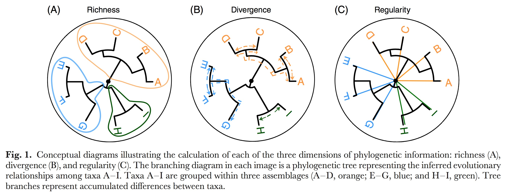
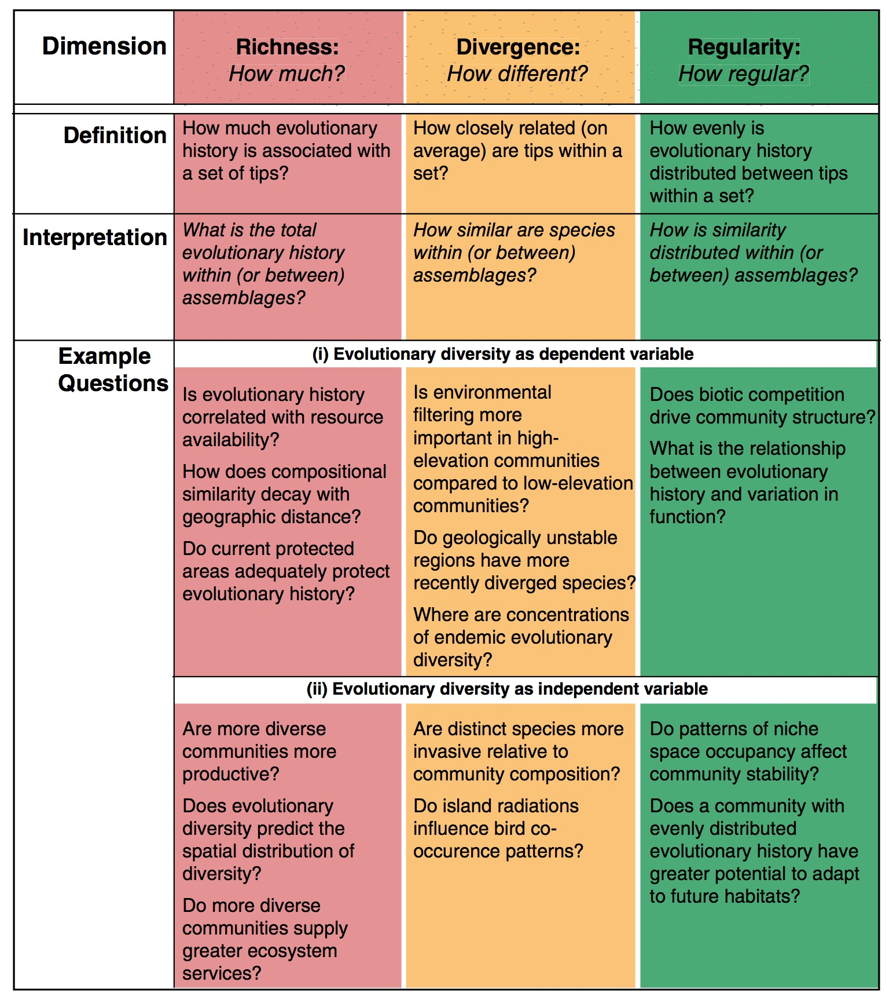

# Module 2: Space and phylogeny summary statistics 
  This is the master document for Module 2, a foundational function in our FARM package that analyzes results from Module 1, the other foundational function. Module 1 simulates a spatial pattern and a phylogenetic tree given a set of environmental and inheritance rules and then Module 2 summarizes those simulated results using a large set of targeted summary statistics. Here we describe our choice of summary statistics, justify those choices as part of a larger theoretical context, and provide our reproducable code for executing the anaylses yourself. These two parts are seperated into modules so that they can act independently. An combination of spatial pattern and associated phylogeny many be used as long as they are formatted correctly.         

This pipeline was designed to analyze a simulated world where all the information is known about both the world and the tree. There is no missing information, just extinct trees. This is much different than our real tree that has loads of uncertainty unevenly destributed across it. The result you see demonstrated right now are one simulated result of many. I need to do a sister page to this were we do this entire analysis on the real tree, or best real tree we've got. 

We have four types of data available for asking research questions using D-place data: [phylogenies](#phylogenetic-summary-statistics), [spatial locations](#spatial-locations), trait identities, and environmental reconstructions. Any one of these four data types alone are relatively information poor, so we are searching for ways to model connections between these data types to draw stronger conclusions overall. 

Other modules can use the summary statistics generated from this module to test hypotheses. We currently have a ABC and Random Forest module started but there will be more to come. 

# Phylogenetic summary statistics  

Whole tree vs. part of tree? These statistics are generally used to compare one sample to another. For example, an experimental contrast between two sites, two phylogenetic groups, or two communities in two different locations. Here we are calculating these statistics for the global langauage tree to compare against global trees created in our simulation. You still retain the ability to subset this tree or others and send only those subsets through this code to compare the values with each other afterwards. 

## Analysis types
1. [Branch Length (richness and divergence)](#branch-lengths)
2. [Pairwise distance between tips (richness, divergence, and regularity)](#pairwise-distance-between-tips)
3. [Phylogenetic isolation (richness, divergence, and regularity)](#phylogenetic-isolation)
4. [Tree topology](#tree-topology)
5. [Macroevolutionary rates](#macroevolutionary-rates)


All trees are ultrametric.

Notations

Alpha-diversity indices
I. Richness indices
1. Using branch lengths
2. Using phylogenetic pairwise distances
3. Using species phylogenetic isolation index
II. Divergence indices
1. Using branch lengths
2. Using phylogenetic pairwise distances
3. Using nearest distances
4. Using phylogenetic isolation index 
III. Regularity indices
1. Using phylogenetic pairwise distances
2. Using nearest distance
3. Using tree topology
4. Using phylogenetic isolation 
	IV. Parametric indices
1. Unified frameworks
		2. Hill numbers adapted to measure phylogenetic diversity


Beta-diversity indices
I. Richness indices (presence–absence data)
II. Divergence indices (using pairwise distances among species)
1. Presence/absence data
A.	Decomposition into , ,  diversities
B.	Direct dissimilarities
1.	Using all distances
2.	Using nearest distances
2. Abundance data
A.	Decomposition into , ,  diversities
B.	Direct dissimilarities
III. Parametric indices
1. Equivalent numbers
2. Entropy


  The choice of phylogenetic analyses and organizational scheme is based on the suggestions of [Tucker et al. 2016](). Here are a few images from that paper for an overview:  








```{r}
#load('~/Downloads/FULL_TREE_Society_data_with_binary_conversions.Rdata')

load('~/Downloads/Tree_FULL_trimmed.Rdata')

this_tree <- full_tree 


load('~/Downloads/download.Rdata')

#str(myOut)

#this_tree <- myOut$mytree
this_world <- myOut$myWorld

#str(this_world)
  #str(all_trees)
  #str(this_tree)


library(knitr)
#kable(this_world, caption= "This is our world")
```


## Branch Lengths
  Branch length data is embedded in the tree object provided to this function. The first step in summarizing the lengths is to extract those data from the tree object. These data are called 'edges' in the tree object. We extract branch lengths and create an object called 'Branch_lengths' for passing on to the other summary functions. The histogram below shows the frequency of different branch lengths found throughout the tree. 
  
```{r}
      Branch_Lengths <- this_tree$edge.length
```

```{r, echo=FALSE}
 # plot the branch lengths
      hist(Branch_Lengths, xlab="Branch Lengths", main="", breaks=1000, border=NA, col=adjustcolor("cornflowerblue", alpha=0.9))
```
We can summarize branch lengths according to normal summary statistics, but it can be difficult to assign evolutionary meaning to some of these metrics and so they are not regularly used as best I can tell. This lack of meaning does not mean that these statistics couldn't be used to distinguish between large simulated trees. 
```{r}
      mean_branch_length <- mean(Branch_Lengths)
      variance_branch_length <- var(Branch_Lengths)
      SD_branch_length <- sd(Branch_Lengths)
```


```{r, echo=FALSE}
paste("mean branch length = ", mean_branch_length)
paste("variance in branch lengths = ", variance_branch_length)
paste("standard deviation in branch lengths = ", SD_branch_length)

```

```{r, echo=FALSE}
boxplot(Branch_Lengths, col=adjustcolor("cornflowerblue", alpha=0.5), border=adjustcolor("cornflowerblue", alpha=1))
```


Phylogenetic diversity ($PD$) is the summation ($\sum$) of all branch lengths connecting species together, where $B_{t}$ is the set of included tips and $L_{b}$ is Branch lengths. (Faith 1992) This is an anchor test, which means it is regularly used, well understood, and we should use it to anchor our work to past work. PD is a richness measure, it tells us how much evolutionary history is associated with a set of tips.  

$$PD = \sum_{b \in B_{t}}^{}L_{b}$$
 
```{r}

# Anchor test = PD (Faith's phylogenetic diversity)
      Pylo_diversity_is_sum_of_BL <- sum(Branch_Lengths)
      Pylo_diversity_is_sum_of_BL
```


 There are variations on this measure that we have NOT implemented here. It is popular to scale this measure according to some ecological driver. Barker (2002) scales branch lengths ($L_{b}$) by multiplying them against the abundance of individuals at at tip ($A_{b}$). Others (Rosauer et al. 2009), scale them by their range size instead ($R_{b}$). 
 
 $$\Delta n PD = \sum_{b \in B_{t}}^{}A_{b}L_{b}$$
$$PE = \sum_{b \in B_{t}}^{}\dfrac{L_{b}}{R_{b}}$$
Argueing that proportional abundance phylogenetic diversity ($PD_{Ab}$) is more effective than the standard PD calculated from raw abundance, Vellend et al. penned a new version of PD where $B$ is the total number of branch lengths ($L_{b}$). Note: We don't have abundance data right now for the human project so this metric is not currently very helpful.   
$$PD_{Ab} = B * \dfrac{\sum_{b \in B_{t}}^{}A_{b}L_{b}}{\sum_{b \in B_{t}}^{}A_{b}}$$

```{r}
      number_of_branches <- length(Branch_Lengths)
```


```{r, echo=FALSE}
      paste("This tree has", number_of_branches, "branches.")
```


Average phylogenetic diversity (avPD) (introduced by Clarke and Warwick 2001) is a branch length-based divergence indices where PD is divided by the total number of tips ($S$) in the tree. 
$$avPD = \dfrac{PD}{S}$$
```{r}
      Number_of_tips <- length(this_tree$tip.label)
      average_phylogenetic_diversity <- Pylo_diversity_is_sum_of_BL / Number_of_tips
      average_phylogenetic_diversity
```


There is also a proportional abundance version of average phylogenetic diversity (Tucker et al. 2016). Again, we don't have abundance values yet for D-place. 
$$avPD_{Ab} = \dfrac{B * \dfrac{\sum_{b \in B_{t}}^{}A_{b}L_{b}}{\sum_{b \in B_{t}}^{}A_{b}}}{S}$$


## Pairwise distance between tips

```{r}

library(phytools)
 ## 0b) Pairwise distance between tips
      Pairwise_dist <- cophenetic(this_tree)
   
      # 2b) Pairwise distance -- Sum of pairwise distances

      # F -- Extensive quadratic entropy
      F_quadratic_entropy_is_sum_of_PD <- sum(Pairwise_dist)

      #Mean inter-species distances

      # Anchor test = MPD (mean pairwise distance)

      Mean_pairwise_distance <- mean(Pairwise_dist)

      #Pairwise distance/all distances -- Variance of pairwise distances

      # Anchor test = VPD (variation of pairwise distance)

      variance_pairwise_distance <- var(as.vector(Pairwise_dist))


```


## Phylogenetic isolation

```{r}
## 0c) Phylogenetic isolation
 library(FARM)

      # Using equal.splits method, faster computation
      Evolutionary_distinctiveness <- evol.distinct2(this_tree, type = "equal.splits")
      
      # ED - Summed evolutionary distinctiveness

      Evolutionary_distinctiveness_sum <- sum(Evolutionary_distinctiveness)

      ## 3d) Phylogenetic isolation -- Mean of species evolutionary distinctiveness

      # mean(ED)

      mean_Phylogenetic_isolation <- mean(Evolutionary_distinctiveness)

      ## 4d) Phylogenetic isolation -- Variance of species isolation metrics

      #var(ED)

      variance_Phylogenetic_isolation <- var(Evolutionary_distinctiveness)
     

```

## Tree topology

```{r}
 ## Tree topology

      #Gamma index

      ltts <- ltt(this_tree, gamma = TRUE, plot = FALSE)
      lineages_through_time <- as.numeric(ltts[[1]])
      time_steps <- as.numeric(ltts[[2]])
      gamma <- ltts[[3]]
      gamma_p_value <- ltts[[4]]
      
```

## Macroevolutionary rates

```{r}

#function name = bd, function input = tree of type 'phylo'
print(bd) 

```


```{r}
 ## Speciation vs extinction rates and Net diversification
     

      bds <- bd(this_tree)
      speciation_rate <- bds[1]
      extinction_rate <- bds[2]
      extinction_per_speciation <- bds[3]
      speciation_minus_extinction <- bds[4]
  
```


```{r}


      ## Speciation vs extinction rates and Net diversification dependent on trait
     # N.for.dom <- table(this_world[, 6])
  #    if(length(N.for.dom) == 2) {
        par.div.dep <- DivDep( mytree = this_tree, myWorld = this_world)
        trait_1_speciation <- par.div.dep[1]
        trait_2_speciation <- par.div.dep[2]
        trait_1_extinction <- par.div.dep[3]
        trait_2_extinction <- par.div.dep[4]
        transition_from_trait_1_to_2 <- par.div.dep[5]
        transition_from_trait_2_to_1 <- par.div.dep[6]
        transition_rate_ratio_1to2_over_2to1 <- transition_from_trait_1_to_2/transition_from_trait_2_to_1
      
```


```{r}
library(ROCR)
        ## Crown age per trait AUC and effect size
        tip.length <- this_tree$edge.length[this_tree$edge[, 2] %in% 1:Ntip(this_tree)]
        tip.length <- (tip.length - min(tip.length)) / (max(tip.length) - min(tip.length))
        this_trait <- this_world[match(this_tree$tip.label, this_world[, 8]), 6]
        tip.length.2 <- tip.length[this_trait == 2]
        tip.length.1 <- tip.length[this_trait == 1]
        model <- glm(as.factor(this_trait) ~ log(tip.length + 1),
                     family = "binomial")
        effect.size <- model$coefficients[2]
       # plot(y = this_trait - 1, x= log(tip.length))
        p <- predict(model, as.factor(this_trait), type = "resp")
       # points(y = p, x = log(tip.length), col = "red")
        pr <- prediction(p, as.factor(this_trait))
        auc.model <- performance(pr, measure = "auc")@y.values[[1]]

      
```


```{r}
  ## Phylogenetic signal (D)
        Phylogenetic_signal <- Dsig(mytree = this_tree, myWorld = this_world)
        
```


# Spatial Locations

```{r}

library(spdep)
 ## Spatial Analysis
        nbs0 <- knearneigh(as.matrix(this_world[, 2:3]), k = 7, longlat = TRUE)
        nbs <- knn2nb(nbs0, sym = TRUE) # 7 symmetric neighbors
        nbs.listw <- nb2listw(nbs)
        factors.nbs <- as.factor(ifelse(is.na(this_world[, 6]), 3, this_world[, 6]))
        spatial.tests <- joincount.test(fx = factors.nbs, listw = nbs.listw)
        spatial.tests.fora <- spatial.tests[[1]]$statistic
        spatial.tests.dom <- spatial.tests[[2]]$statistic
        prevalence <- (N.for.dom[1] - N.for.dom[2]) / sum(N.for.dom)
```


```{r}
results_summary_matrix_1 <- cbind(

        number_of_branches,
        Pylo_diversity_is_sum_of_BL,
        average_phylogenetic_diversity_is_mean_of_BL,
        variance_Pylo_diversity_is_variance_of_BL,

        F_quadratic_entropy_is_sum_of_PD,
        Mean_pairwise_distance,
        variance_pairwise_distance,

        Evolutionary_distinctiveness_sum,
        mean_Phylogenetic_isolation,
        variance_Phylogenetic_isolation,

        gamma,
        gamma_p_value,
        speciation_rate,
        extinction_rate,
        extinction_per_speciation,
        speciation_minus_extinction,
        trait_1_speciation,
        trait_2_speciation ,
        trait_1_extinction ,
        trait_2_extinction ,
        transition_from_trait_1_to_2 ,
        transition_from_trait_2_to_1 ,
        transition_rate_ratio_1to2_over_2to1 ,
        Phylogenetic_signal,
        spatial.tests.fora,
        spatial.tests.dom,
       # prevalence,
       # auc.model,
        effect.size
      )
      rownames(results_summary_matrix_1) <- 1

      results_summary_matrix_2 <- cbind(
        c(Evolutionary_distinctiveness,NA),
        lineages_through_time,
        time_steps
      )
      colnames(results_summary_matrix_2) <- c("Evolutionary_distinctiveness", "lineages_through_time", "time_steps")
      head(results_summary_matrix_2)

      ### Returns from function in list form
      returns <- list(
        #Branch_Lengths,
        #Pairwise_dist,
        results_summary_matrix_1,
        results_summary_matrix_2

      )

      names(returns) <- c(
        #"Branch_Lengths",
        #"Pairwise_distance",
        "results_summary_of_single_value_outputs",
        "results_summary_matrix_of_multi_value_outputs"
      )
      
      
```


## Module2() returns these two matrices as a list 


```{r, echo=FALSE}
kable(returns$results_summary_of_single_value_outputs, caption= "This is our world")
     
```


```{r, echo=FALSE}
 kable(returns$results_summary_matrix_of_multi_value_outputs, caption= "This is our world")
```


