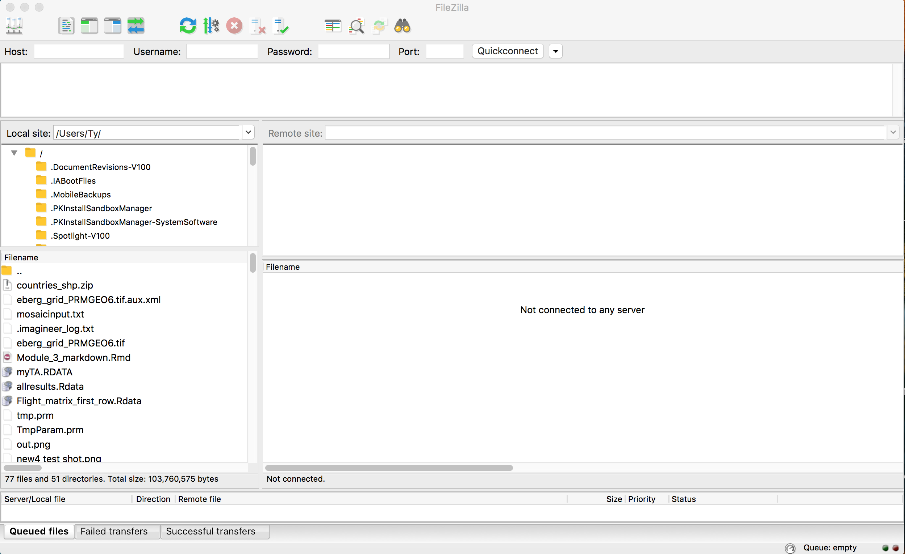
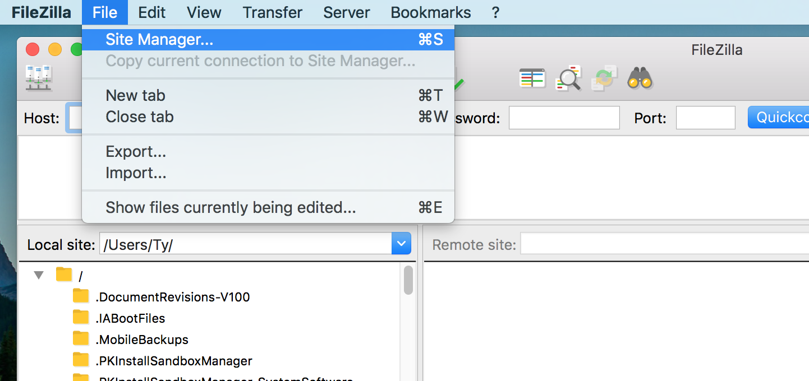
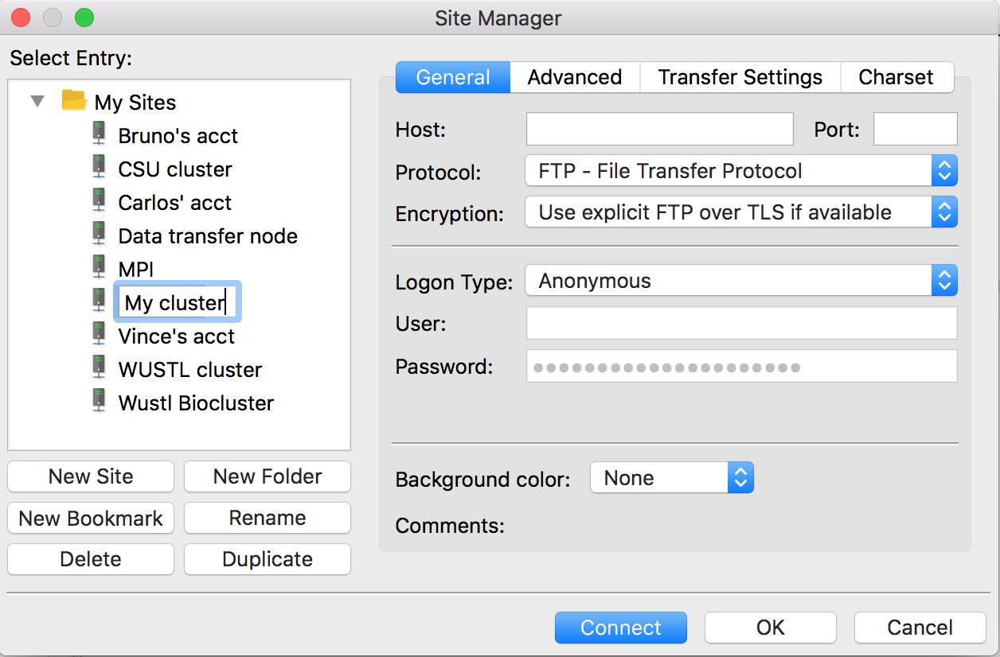
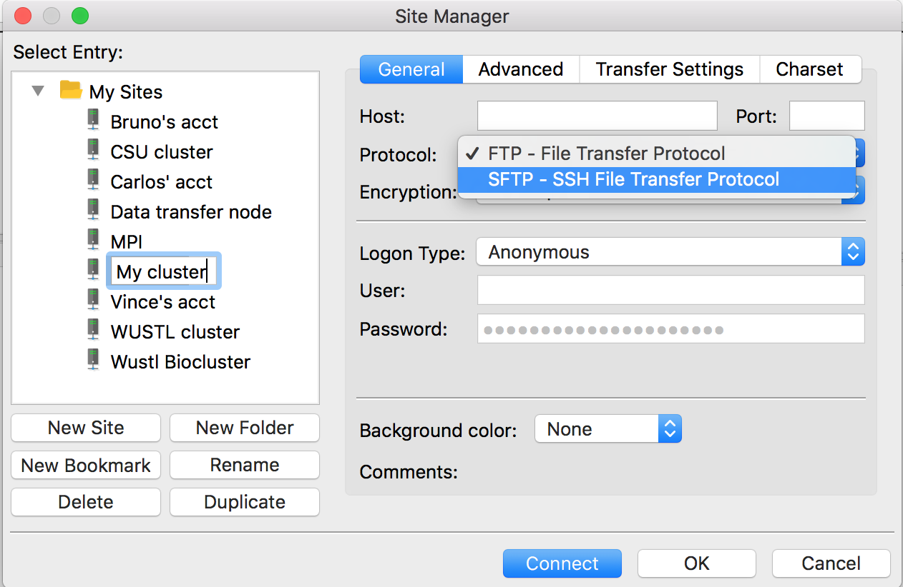
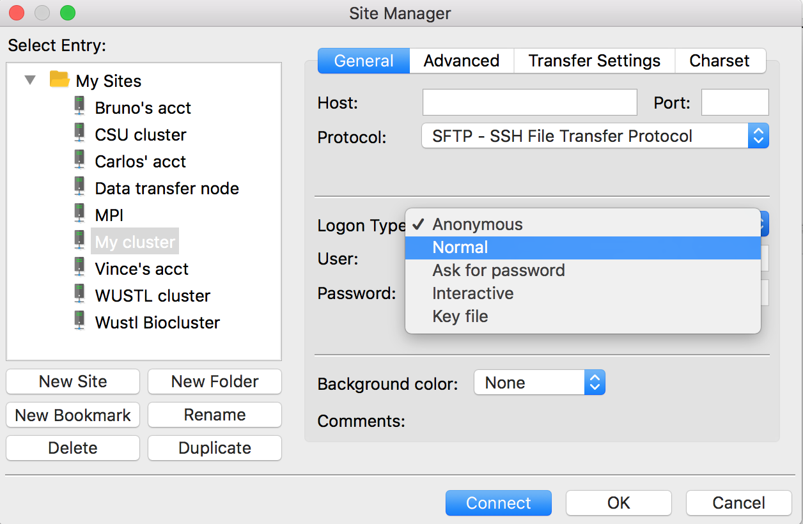
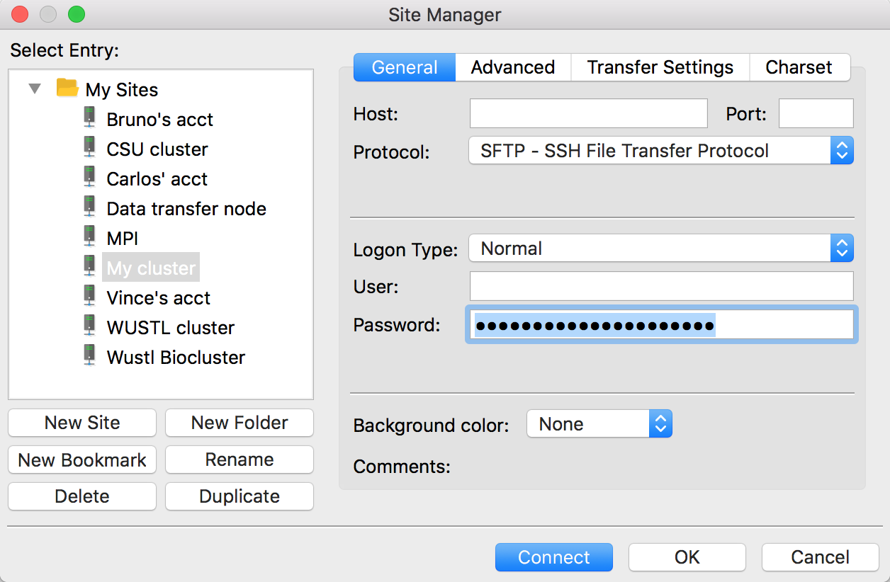
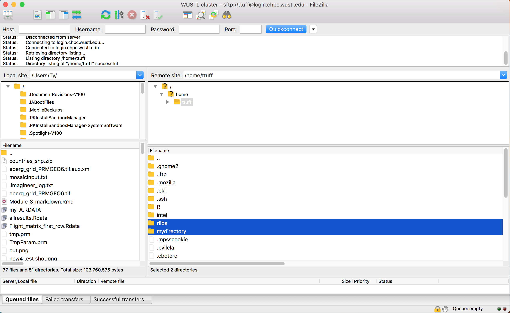
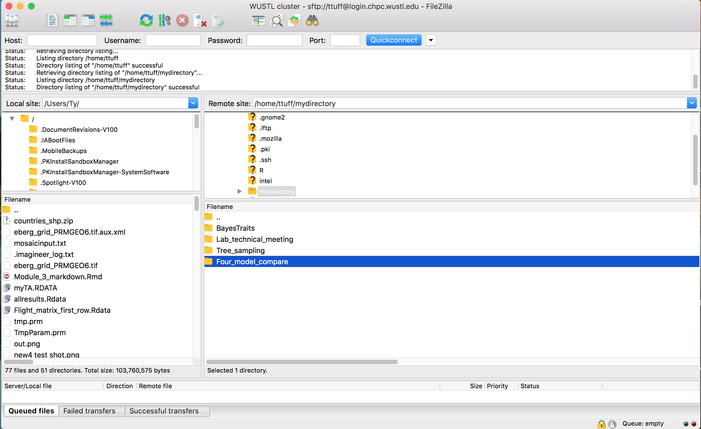
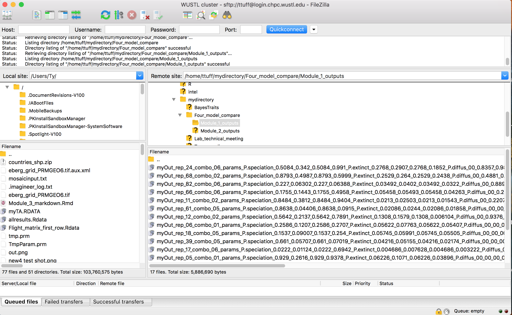
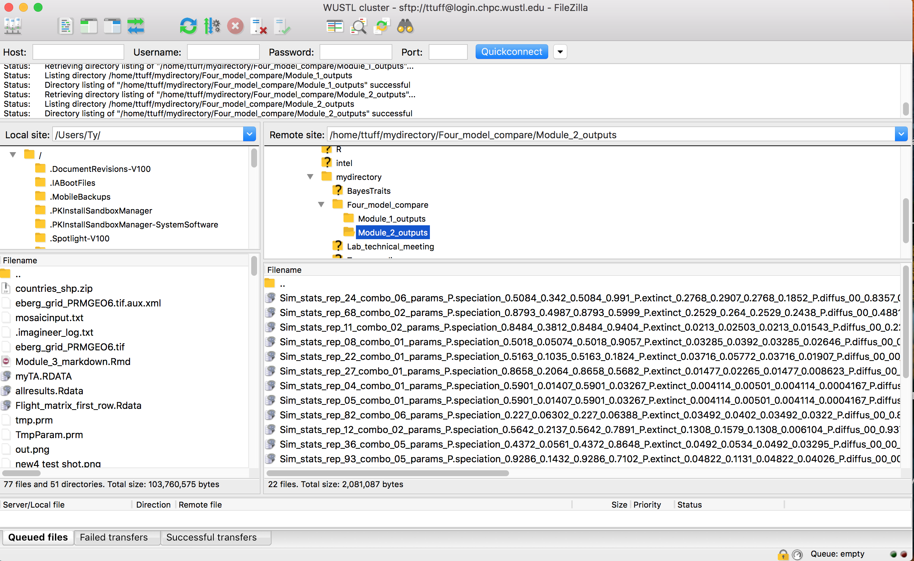

# Running simulations on the cluster

## Not for the faint of hart


## Bash scripts
Running an R script on the cluster requires two parts: an R script with the code
to be run and a PBS script to control how that R script is run on the cluster.


There are two different clusters at Wustl.edu, an old and a new cluster. This
script runs the R code on the new cluster. 


```{bash eval=FALSE}
#!/bin/bash
#PBS -N Four_model_run 
#PBS -V 					
#PBS -l walltime=23:59:00				
#PBS -l pmem=1200mb 
#PBS -l nodes=1:ppn=1:haswell 
#PBS -t 1-1000


echo $PBS_ARRAYID

cd /home/cbotero/mydirectory/Four_model_compare
module load R

export R_LIBS=$HOME/rlibs
#R CMD INSTALL --library=/home/ttuff/rlibs  FARM_1.0.tar.gz

Rscript --vanilla ./FARM_four_model_compare.R ${PBS_ARRAYID}
```


We were regularly causing problems running to many jobs on the new cluster and 
we were asked to move to the old cluster. This cluster has slower individual 
processors, but we can run more jobs at one time, so productivity has stayed 
about the same. 

```{bash eval=FALSE}
#!/bin/bash
#PBS -N FARM_third_run_old 
#PBS -V 					
#PBS -l walltime=160:00:00				
#PBS -l pmem=1200mb 
#PBS -q old
#PBS -l nodes=1:ppn=1:nehalem 
#PBS -t 1-500


echo $PBS_ARRAYID

cd /home/ttuff/mydirectory/Four_model_compare
module load R

export R_LIBS=$HOME/rlibs
#R CMD INSTALL --library=/home/ttuff/rlibs  FARM_1.0.tar.gz

Rscript --vanilla ./FARM_four_model_compare.R ${PBS_ARRAYID} 

```

## Passing arguements to R-script
The final argument in the #PBS script above (#PBS -t 1-500) controls the serial 
running schema for running many simultanious instances of the R script at a 
time. This argument is passes to R as an integer value using the following
arguements inside R. 
```{r eval=FALSE}

args <- commandArgs(trailingOnly = FALSE) #7 elements are passed from the PBS

NAI <- as.numeric(args[7]) # the seventh of those elements is the array integer.

```


Here is a working example of how to set up the R script.
```{r}
#install.packages("rfoaas")
library(rfoaas)

##If the PBS script started this code running and passed the number 13
##to this particular run of a larger serial set. 


#args <- commandArgs(trailingOnly = FALSE) 

NAI <- 13 #as.numeric(args[7])

	sayHello <- function(loop_number){
   	  print(paste0("I can count to ", loop_number, "!   ", cool(from="Ty")))
	}

	sayHello(NAI)

```

## Accessing and working with the cluster
You logon to the cluster using linux/unix code from the command line 
terminal on you computer. Open the terminal and put in you login info.


```{bash eval=FALSE}
ssh -Y ttuff@login.chpc.wustl.edu
password:_______
```

Upon first login, you will be in a folder called 'HOME' with a series of system 
files in it. You will want to use an FTP client to view and organize these 
files. I prefer Filezilla, but there are several other good clients available 
for free. Download filezilla, make sure it's in your applications folder, and
open it. You should see a window that looks like a newer version of this. The 
left panels are the files on the computer you're working from and the right
two panels will show the files on the server once you log in through Filezilla
also. 
























Once logged in, you need to change the directory
```{bash eval=FALSE}
cd /home/ttuff/mydirectory/Four_model_compare
```







